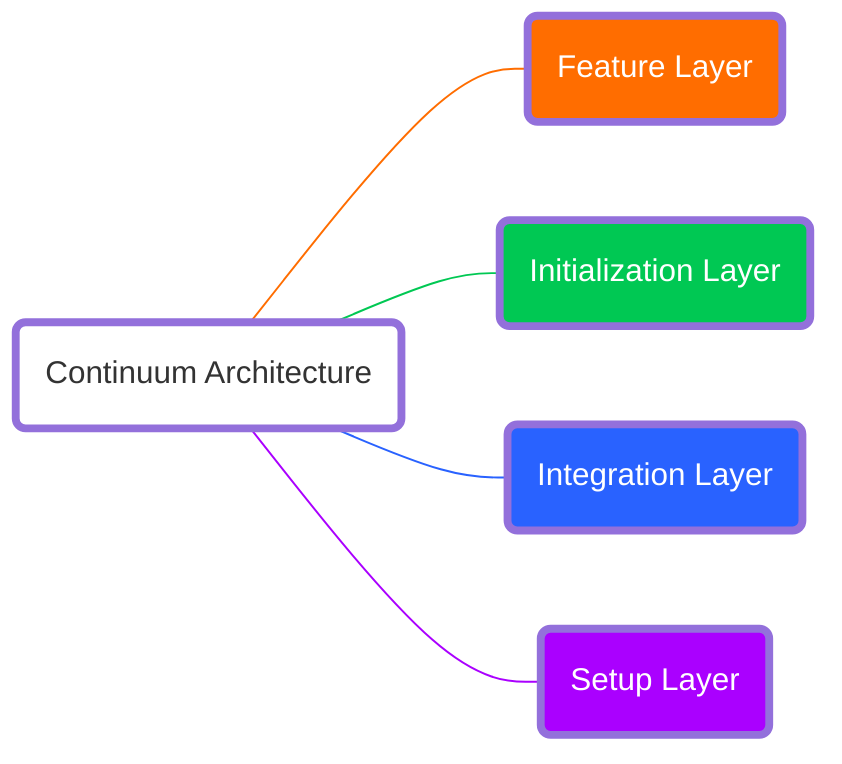

Welcome to **Stone.js**, the agnostic micro framework designed to make your life easier, whether you're building nano apps or macro applications. Our mission is simple: create once, deploy everywhere.

## Vision

At Stone.js, our vision is to empower businesses to save money and reduce production costs while seamlessly migrating to cloud-native environments. Our framework ensures that your applications remain independent of any specific cloud platform, allowing them to run anywhere – be it locally, on servers, containers, serverless platforms, or in the cloud.

Here's what we're aiming for:

- **Cost Efficiency:** Helping businesses cut down on production costs.
- **Cloud-Native Transition:** Smooth migration to cloud-native environments.
- **Platform Independence:** Ensuring your applications can operate on any platform.
- **Scalability:** Facilitating the creation of applications from nano to macro scale.
- **Configuration-Free Deployment:** Running applications everywhere without needing to tweak configurations or functionalities.
- **Collaboration and Development:** Facilitating collaboration and development.
- **Reduced Development Time:** Reducing the time needed for development.

## Mission

Our mission is to build a modular, flexible framework that makes scalable development a breeze. We want to simplify the process of creating both small and large applications, ensuring that you can start your projects with zero configuration and adjust settings dynamically as needed.

We're committed to:

- **Modular and Flexible Design:** Crafting a framework that's both modular and flexible.
- **Scalable Development:** Easing the path to scalable development.
- **Nano to Macro App Creation:** Supporting the development of applications of all sizes.
- **Zero Configuration Start:** Allowing projects to begin with zero configuration.
- **Dynamic Configuration:** Enabling dynamic configuration adjustments.
- **Standards and Best Practices:** Utilizing market standards and best practices, along with the renowned libraries available on npmjs, developed by passionate developers.

## The Stone.js Advantage

### Write Once, Run Everywhere

Imagine writing your application code once and having it run seamlessly across different environments. With Stone.js, that's a reality. Whether it's local environments, servers, serverless platforms, or cloud Function-as-a-Service (FaaS), Stone.js has you covered. No need to worry about platform dependencies – your code just works.

### Cloud-Native and Cost-Effective

Stone.js is engineered to take full advantage of cloud-native features, ensuring that your applications are not only powerful but also cost-effective. By leveraging cloud-native functionalities, businesses can significantly reduce costs while maximizing performance and efficiency.

### Continuum Architecture

Our framework is built on the robust Continuum Architecture, which provides a layered approach to omnipresent application development:

- **Setup Layer:** Responsible for loading and constructing initial configurations automatically.
- **Integration Layer:** Bridges the platform and the framework, handling input conversion and communication.
- **Initialization Layer:** Sets up the application environment, bootstraps components, and processes events.
- **Feature Layer:** Contains user-defined functionalities and business logic.

### Evergreen Framework

We're committed to sustainability. Stone.js is designed to be an evergreen framework, helping businesses reduce their carbon footprint. By optimizing resources and leveraging efficient cloud-native technologies, we aim to make a positive impact on the environment.

## Open Source and Community

Stone.js is a new and ambitious open-source project, inviting all enthusiasts to join this great adventure and contribute in any way they can. Our goal is to leverage cloud-native capabilities to create cost-effective applications. The Continuum Architecture and Omniplex Application concepts were born to make this dream possible, also facilitating local development and deployment everywhere.

Published under the [Apache License 2.0](https://www.apache.org/licenses/LICENSE-2.0), Stone.js stands on the shoulders of giants, using market standards, best practices, and the wonderful libraries available on npmjs.

## Target Audience

Stone.js is for developers and businesses looking to create versatile, high-performing applications with ease. Whether you're a startup building your first nano app or an enterprise developing a complex macro application, Stone.js provides the tools and flexibility you need to succeed.

Ready to dive in? Let's get started with Stone.js and revolutionize the way you build applications. With a touch of humor and a lot of power, we're here to make your development journey smooth, efficient, and fun.

Let's get started: [Installation](./installation.md)