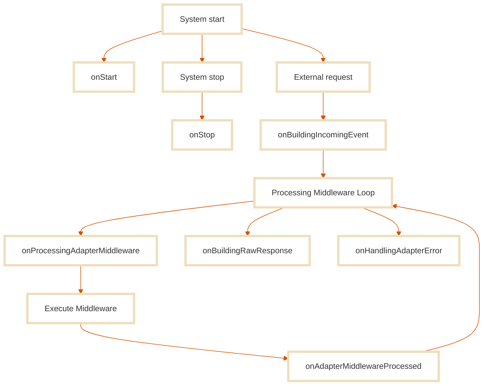

Adapters in Stone.js are the official bridge between your application and the outside world. Whether you’re running in a Node.js server, 
a FaaS like AWS Lambda, a browser, or a CLI, adapters make it all feel the same from your application’s perspective.

### What is an adapter?

An adapter is a module that translates an external request into a normalized internal event (`IncomingEvent`) and transforms your system's response (`OutgoingResponse`) back into a format that the underlying platform understands.

Think of it as a platform-specific translator. It wraps the unpredictable, environment-specific inputs and outputs into the standardized flow that your Stone.js system expects.

### Why use adapters?

Adapters let you write one system that runs everywhere. They abstract away the platform-specific protocols, runtimes, and APIs, giving you:

- **Runtime independence**: The same logic works in the browser, on a server, or in a FaaS.
- **Seamless event handling**: Every platform ends up producing the same kind of internal event.
- **Unified development model**: You don't need to worry about how requests arrive, just what they mean.

Adapters are central to Stone.js's mission: **build once, deploy anywhere**.

### Where adapters fit in the Continuum Architecture

In the Continuum Architecture, adapters belong to the **Integration Dimension**.


This is the layer that mediates between:

- The **external context** (HTTP server, CLI input, browser events, FaaS triggers...)
- And the **internal system** (your application logic and domain)

Adapters **transform context**, letting your business logic ignore where requests come from, and still respond correctly.

They're the gatekeepers of your application. Every event starts with them.

### How adapters work at runtime

At runtime and after the Setup Phase, an adapter is the first thing executed. It:

1. Receives a platform-native request (like an HTTP request, console args, or FaaS event).
2. Uses an **input builder** to create a standardized `IncomingEvent`.
3. Passes the event to the system’s kernel for processing.
4. Receives the `OutgoingResponse`.
5. Uses an **output builder** to convert it back into a format the platform understands.

The entire journey, from real-world input to platform-specific output, is encapsulated within the adapter.


## Using Adapters

Stone.js adapters are the entry points into your system. 
They let you connect your code to any execution context, Node.js, FaaS, the browser, or the CLI, without changing your internal logic.

This section explains how to **install**, **activate**, **configure**, and **orchestrate** multiple adapters, using both the declarative and imperative APIs. We'll use the Node.js HTTP adapter in examples, but the same concepts apply to any other adapter.

### Registering Adapters

Before using any adapter, you must install and register it.

#### Install

Stone.js is framework-agnostic by design, no adapter is bundled by default. You choose what to install:

::: tip
The Node HTTP adapter is installed and activated by default when you create a new Stone.js project using the CLI.
:::

```bash
npm install @stone-js/node-http-adapter
```

Once installed, you're ready to activate it in your system.

#### Activate

You can register adapters using either the **declarative** or **imperative** API.

::: tabs#declarative-imperative
@tab:active Declarative
##### Declarative

Use the adapter’s decorator (e.g., `@NodeHttp()`) on your main entry point class:

```ts
import { NodeHttp } from '@stone-js/node-http-adapter'
import { IncomingEvent, IEventHandler, StoneApp } from '@stone-js/core'

@NodeHttp()
@StoneApp()
export class Application implements IEventHandler<IncomingEvent> {
  handle(event: IncomingEvent) {
    return { message: 'Hello world!' }
  }
}
```

This automatically binds the adapter to your application in a platform-aware way.

@tab Imperative
##### Imperative

Register the adapter blueprint using `defineBlueprintConfig`:

```ts
import { defineBlueprintConfig, IncomingEvent } from '@stone-js/core'
import { nodeHttpAdapterBlueprint } from '@stone-js/node-http-adapter'

const Application = (event: IncomingEvent) => ({ message: 'Hello world!' })

export const mainBlueprint = defineBlueprintConfig((blueprint) => {
  blueprint
    .set(nodeHttpAdapterBlueprint)
    .set('stone.kernel.eventHandler', Application)
})
```

This provides full programmatic control over registration.

:::

### Built-in Adapters
Stone.js comes with several built-in adapters, each tailored for a specific environment. You can also create your own custom adapters if needed.

#### Installation
In this table, you can find the available adapters and their installation commands.

| Adapter         | Description                            | Install Command                                 |
| --------------- | -------------------------------------- | ----------------------------------------------- |
| Node HTTP       | Runs on a Node.js HTTP server          | `npm install @stone-js/node-http-adapter`       |
| Node CLI        | For command-line applications          | `npm install @stone-js/node-cli-adapter`        |
| Browser         | Runs in SPA/SSR client-side apps       | `npm install @stone-js/browser-adapter`         |
| AWS Lambda      | Runs in a generic AWS Lambda function  | `npm install @stone-js/aws-lambda-adapter`      |
| AWS Lambda HTTP | Runs in HTTP-based AWS Lambda function | `npm install @stone-js/aws-lambda-http-adapter` |

#### Registration
In this table, you can find their registration methods.

| Adapter         | Declarative Decorator | Imperative Blueprint            |
| --------------- | --------------------- | ------------------------------- |
| Node HTTP       | `NodeHttp`            | `nodeHttpAdapterBlueprint`      |
| Node CLI        | `NodeConsole`         | `nodeConsoleAdapterBlueprint`   |
| Browser         | `Browser`             | `browserAdapterBlueprint`       |
| AWS Lambda      | `AwsLambda`           | `awsLambdaAdapterBlueprint`     |
| AWS Lambda HTTP | `AwsLambdaHttp`       | `awsLambdaHttpAdapterBlueprint` |


### Multiple Adapters

Stone.js lets you register multiple adapters at once. This allows your app to run in different environments (e.g., Node + Browser) from a single system definition.

```bash
npm install @stone-js/node-http-adapter @stone-js/browser-adapter
```

Then register them either declaratively or imperatively, they can coexist without conflict.

::: tabs#declarative-imperative
@tab:active Declarative
##### Declarative

```ts
import { Browser } from '@stone-js/browser-adapter'
import { NodeHttp } from '@stone-js/node-http-adapter'
import { IncomingEvent, IEventHandler, StoneApp } from '@stone-js/core'

@Browser()
@NodeHttp()
@StoneApp()
export class Application {}
```

@tab Imperative
##### Imperative

```ts
import { browserAdapterBlueprint } from '@stone-js/browser-adapter'
import { defineBlueprintConfig, IncomingEvent } from '@stone-js/core'
import { nodeHttpAdapterBlueprint } from '@stone-js/node-http-adapter'

export const mainBlueprint = defineBlueprintConfig((blueprint) => {
  blueprint
    .set(browserAdapterBlueprint)
    .set(nodeHttpAdapterBlueprint)
})
```
:::

### Implicit Activation (Contextual Decoherence)

When multiple adapters are installed, Stone.js keeps them in a **superposition** state. 
At runtime, it infers the appropriate adapter based on the external context, this is called **contextual decoherence** in the Continuum.

You don’t need to decide; the system does it for you. This makes Stone.js feel magically universal.

### Explicit Activation

For full control, you can explicitly define which adapter should be used at runtime.

::: tabs#declarative-imperative
@tab:active Declarative
#### Declarative Control

You can use options directly in the adapter decorators:

- `current`: Forces this adapter to be the one used at runtime
- `default`: Marks this adapter as the fallback if none are explicitly selected
- `alias`: Names this adapter so you can refer to it later

Example:

```ts
import { Browser } from '@stone-js/browser-adapter'
import { NodeHttp } from '@stone-js/node-http-adapter'
import { StoneApp, IncomingEvent, IEventHandler } from '@stone-js/core'

@StoneApp()
@NodeHttp({ alias: 'MyNodeAdapter' })
@Browser({ alias: 'MyBrowserAdapter' })
export class Application implements IEventHandler<IncomingEvent> {
  handle(event: IncomingEvent) {
    return { message: 'Hello world!' }
  }
}
```

You can then resolve the current adapter based on runtime conditions using configuration:

```ts
import { Configuration, IConfiguration, IBlueprint } from '@stone-js/core'

@Configuration()
export class MyConfig implements IConfiguration {
  configure(blueprint: IBlueprint) {
    blueprint.set(
      'stone.adapter.alias',
      typeof window !== 'undefined' ? 'MyBrowserAdapter' : 'MyNodeAdapter'
    )
  }
}
```

Stone.js will use the `MyBrowserAdapter`'s adapter if running in a browser, or `MyNodeAdapter`'s adapter otherwise.

@tab Imperative
#### Imperative Control

You can also use pure logic in your `defineBlueprintConfig` to select the adapter based on platform:

```ts
import { browserAdapterBlueprint } from '@stone-js/browser-adapter'
import { defineBlueprintConfig, IncomingEvent } from '@stone-js/core'
import { nodeHttpAdapterBlueprint } from '@stone-js/node-http-adapter'

const Application = (event: IncomingEvent) => ({ message: 'Hello world!' })

export const mainBlueprint = defineBlueprintConfig((blueprint) => {
  blueprint
    .set('stone.kernel.eventHandler', Application)
    .set(
      typeof window !== 'undefined'
        ? browserAdapterBlueprint
        : nodeHttpAdapterBlueprint
    )
})
```

Stone.js will use the `browserAdapterBlueprint` if running in a browser, or `nodeHttpAdapterBlueprint` otherwise.
:::

### Configure Adapters

Because the current adapter is resolved dynamically at runtime, 
you also need to configure it at runtime using the [Blueprint Middleware](./blueprint#dynamic-configuration).

::: tabs#declarative-imperative
@tab:active Declarative
#### Declarative Setup

Use the `@ConfigMiddleware()` decorator to define a Blueprint Middleware:

```ts
import { MyMiddleware } from './my-middleware'
import {
  ConfigMiddleware, BlueprintContext, NextMiddleware
} from '@stone-js/core'

@ConfigMiddleware()
export class MySetupMiddleware {
  async handle(context: BlueprintContext, next: NextMiddleware) {
    const blueprint = await next(context)

    if (blueprint.get('stone.adapter.platform') === 'browser') {
      blueprint.add(
        'stone.adapter.middleware',
        [{ module: MyMiddleware, isClass: true }]
      )
    }

    return blueprint
  }
}
```

@tab Imperative
#### Imperative Setup

Define the setup middleware as a function:

```ts
import { MyMiddleware } from './my-middleware'
import {
  defineBlueprintConfig, BlueprintContext, NextMiddleware
} from '@stone-js/core'

const MySetupMiddleware = async (
  context: BlueprintContext,
  next: NextMiddleware
) => {
  const blueprint = await next(context)

  if (blueprint.get('stone.adapter.platform') === 'browser') {
    blueprint.add(
      'stone.adapter.middleware',
      [{ module: MyMiddleware, isClass: true }]
    )
  }

  return blueprint
}

export const appBlueprint = defineBlueprintConfig((blueprint) => {
  blueprint.add('stone.blueprint.middleware', [MySetupMiddleware])
})
```

:::

In this example we first get the `Blueprint` from `next` to make sure the current adapter is already inferred. 
Then we check the `stone.adapter.platform` property to see if the current adapter is a browser adapter.
If it is, we add our custom middleware to the `stone.adapter.middleware` property.

### Built-in Adapter Options

Each adapter exposes custom options to fine-tune its behavior. Here are some examples:

| Option             | Description                                                                              | Adapter   | Readonly |
| ------------------ | ---------------------------------------------------------------------------------------- | --------- | -------- |
| `middleware`       | List of middleware modules to be used by the adapter                                     | All       | No       |
| `alias`            | The name of the adapter, used for resolving the current adapter at runtime               | All       | No       |
| `current`          | Whether this adapter should be used as the current one at runtime                        | All       | No       |
| `default`          | Whether this adapter should be used as the default if no other is selected               | All       | No       |
| `platform`         | The platform the adapter is running on (e.g., `node_http`, `browser`, `aws_lambda_http`) | All       | Yes      |
| `variant`          | The variant of the adapter (e.g., `server`, `browser`, `console`)                        | All       | Yes      |
| `url`              | Base URL used to launch the HTTP server                                                  | Node HTTP | No       |
| `isSsl`            | Whether to use HTTPS                                                                     | Node HTTP | No       |
| `server`           | Node HTTP server options (e.g., port, cert, host)                                        | Node HTTP | No       |
| `printUrls`        | If `true`, prints the final server URL at startup                                        | Node HTTP | No       |
| `serverMiddleware` | Low-level HTTP middleware (like `connect` or `express`) before Stone Adapter middleware  | Node HTTP | No       |
| `events`           | Array of DOM event types to transform into Stone `IncomingEvent`s                        | Browser   | No       |
| `commands`         | List of command definitions as `MetaCommandHandler[]`                                    | Node CLI  | No       |


## Adapter Middleware

Adapter middleware in Stone.js are not general-purpose middlewares. They don’t handle authentication, logging, or cross-cutting concerns. Instead, they serve a very specific purpose: they are **builders** that translate raw external inputs into normalized system events, and convert system responses back into platform-native outputs.

These middlewares operate at the **adapter level**, and are executed **before** your system logic runs. They allow you to participate in the construction of:

- `IncomingEvent`: the standardized event passed to your system
- `rawResponse`: the platform-native response that is sent back to the external context

To do this, they expose two builder objects:

- `incomingEventBuilder`: used to assemble the `IncomingEvent`
- `rawResponseBuilder`: used to generate the final platform response from the `OutgoingResponse`

Adapter middleware are a critical part of the **Integration Dimension**, responsible for transforming raw, unpredictable context into clean, normalized system flow, before your application logic even sees it.

### Context and Builders

Each adapter middleware receives an `AdapterContext`, a structured object that provides access to both the raw platform data and the tools needed to build normalized system events and responses.

This context varies slightly depending on the adapter (Node.js, Lambda, Browser, etc.), but always follows the same structure:

```ts
interface AdapterContext {
  rawEvent: RawEventType
  rawResponse?: RawResponseType
  executionContext: ExecutionContextType
  incomingEvent?: IncomingEventType
  outgoingResponse?: OutgoingResponseType
  incomingEventBuilder: IAdapterEventBuilder
  rawResponseBuilder: IAdapterEventBuilder
}
```

Here’s what each property represents:

- **`rawEvent`**  
  The original request or trigger received from the platform. This could be an HTTP request in Node.js, a Lambda event, CLI arguments, or a browser event.  
  → *You use this to extract data when building the `IncomingEvent`.*

- **`rawResponse`** *(optional)*  
  The raw platform-specific response object (e.g., Node.js response stream).  
  → *Never modify this directly, always use `rawResponseBuilder` to shape the response.*

- **`executionContext`**  
  A platform-specific object related to the environment in which the adapter is running. For example, this could be the Node HTTP server or AWS Lambda context object.  
  → *Used for platform-related metadata if needed.*

- **`incomingEvent`** *(optional)*  
  The normalized `IncomingEvent` built from the `incomingEventBuilder`.  
  → *Do not mutate this. If you want to affect it, use the builder before calling `next()`.*

- **`outgoingResponse`** *(optional)*  
  The final `OutgoingResponse` returned by your system logic after `next()` has been called.  
  → *You can read this to help shape the final output using `rawResponseBuilder`.*

- **`incomingEventBuilder`**  
  A mutable builder object used to construct the `IncomingEvent`.  
  → *Call `add()` or `addIf()` to incrementally build the event.*

- **`rawResponseBuilder`**  
  A builder for producing the final platform-native response from the system’s `OutgoingResponse`.  
  → *Also uses `add()` and `addIf()` to shape the output before returning it to the platform.*

::: important
Only the builders (`incomingEventBuilder`, `rawResponseBuilder`) are meant to be mutated inside middleware. All other fields are for reading or inspection.
:::

### Working with Builders

Each builder offers two methods:

- `add(key, value)`: Adds a key-value pair to the builder.
- `addIf(key, value)`: Adds value only if the key is not already present.

#### Input Builder: `incomingEventBuilder`

Transforms the external platform request into a normalized `IncomingEvent`.

Example:

```ts
context.incomingEventBuilder
  .add('headers', context.rawEvent.headers)
  .addIf('method', context.rawEvent.method)
```

#### Output Builder: `rawResponseBuilder`

Converts the `OutgoingResponse` back to the platform-native format, using `context.outgoingResponse` after the handler has executed.

You gain access to both the `incomingEvent` and `outgoingResponse` **after** calling `next()`:

```ts
const rawResponseBuilder = await next(context)

rawResponseBuilder
    .add('headers', context.outgoingResponse.headers)
    .add('statusCode', context.outgoingResponse.statusCode)

return rawResponseBuilder
```

::: tip
For adapter-specific details about the context structure and available builder options, refer to the README of the corresponding adapter package on npm or GitHub.
:::

### Defining Middleware

Adapter middleware can be defined either **declaratively** using decorators, or **imperatively** using factory functions. Both approaches allow you to inject logic into the building of `IncomingEvent` before your system logic executes, and to shape the `rawResponse` before it is sent back to the platform.

::: tabs#declarative-imperative
@tab:active Declarative
#### Declarative Middleware

The simplest way to define adapter middleware is through a class decorated with `@AdapterMiddleware()`.

```ts
import {
  AdapterMiddleware, NextMiddleware, IBlueprint
} from '@stone-js/core'
import {
  NodeHttpAdapterContext, NodeHttpAdapterResponseBuilder
} from '@stone-js/node-http-adapter'

@AdapterMiddleware()
export class MyAdapterMiddleware {
  private readonly blueprint: IBlueprint

  constructor ({ blueprint }: { blueprint: IBlueprint }) {
    this.blueprint = blueprint
  }

  async handle(
    context: NodeHttpAdapterContext,
    next: NextMiddleware<NodeHttpAdapterContext, NodeHttpAdapterResponseBuilder>
  ): Promise<NodeHttpAdapterResponseBuilder> {
    context.incomingEventBuilder
      .add('headers', context.rawEvent.headers)
      .add('metadata', this.blueprint.metadata)

    return await next(context)
  }
}
```

This middleware will apply to **all adapters**, unless explicitly scoped.

@tab Imperative
#### Imperative Middleware

You can also define middleware as a factory function and register it manually during blueprint setup:

```ts
import { NextMiddleware, IBlueprint } from '@stone-js/core'
import {
  NodeHttpAdapterContext, NodeHttpAdapterResponseBuilder
} from '@stone-js/node-http-adapter'

const MyAdapterMiddleware = ({ blueprint }: { blueprint: IBlueprint }) => {
  return async (
    context: NodeHttpAdapterContext,
    next: NextMiddleware<NodeHttpAdapterContext, NodeHttpAdapterResponseBuilder>
  ): Promise<NodeHttpAdapterResponseBuilder> => {
    context.incomingEventBuilder
      .add('metadata', blueprint.metadata)
      .add('headers', context.rawEvent.headers)

    return await next(context)
  }
}
```

To register this middleware, use a setup middleware:

```ts
import { defineBlueprintConfig } from '@stone-js/core'

const MySetupMiddleware = async (context, next) => {
  const blueprint = await next(context)

  blueprint.add('stone.adapter.middleware', [
    { module: MyAdapterMiddleware, isFactory: true }
  ])

  return blueprint
}

export const appBlueprint = defineBlueprintConfig((blueprint) => {
  blueprint.add('stone.blueprint.middleware', [MySetupMiddleware])
})
```
:::

::: important
At the time adapter middleware is constructed, whether as a class or factory, only the blueprint is available, as the Stone.js container has not yet been initialized.
:::

### Scoping Middleware

When your system uses multiple adapters, it's important to scope each middleware to the adapter it is intended for. This avoids accidental misbehavior across platforms.

::: tabs#declarative-imperative
@tab:active Declarative
#### Declarative Scoping

You can scope middleware by using one of the following options in the decorator:

- `platform`: a string identifier for the adapter's platform (e.g., `'node_http'`, `'browser'`)
- `adapterAlias`: the alias assigned to the adapter when it was registered

```ts
@AdapterMiddleware({ platform: 'node_http' })
export class NodeOnlyMiddleware { /* ... */ }

@AdapterMiddleware({ adapterAlias: 'MyBrowserAdapter' })
export class BrowserOnlyMiddleware { /* ... */ }
```
@tab Imperative
#### Imperative Scoping

You can also perform manual checks during blueprint setup and conditionally add the middleware:

```ts
const MySetupMiddleware = async (context, next) => {
  const blueprint = await next(context)

  if (blueprint.get('stone.adapter.platform') === 'browser') {
    blueprint.add('stone.adapter.middleware', [
      { module: MyAdapterMiddleware, isFactory: true }
    ])
  }

  return blueprint
}
```

This approach offers complete flexibility, especially useful when adapter selection depends on runtime context.
:::

### Notes

- To see what fields are available for `incomingEventBuilder`, refer to the [**Incoming Event**](../essentials/incoming-event) documentation.
- To understand what values are accessible from `OutgoingResponse`, check the [**Outgoing Response**](../essentials/outgoing-response) documentation.

## Integration Hooks

Integration hooks in Stone.js allow you to observe and react to the platform-specific phases of your system, including adapter startup, event transformation, middleware execution, and shutdown.



These hooks belong to the **Integration Dimension** of the Continuum Architecture. They do not affect your application logic directly, but instead provide a clean mechanism to tap into low-level system behavior. They're useful for logging, metrics, debugging, diagnostics, and graceful shutdowns, all without polluting your core system logic.

There are two types of integration hooks:
- **Global hooks**, triggered during lifecycle events like startup or shutdown.
- **Per-intention hooks**, triggered during adapter-level processing, such as when building events, running middleware, or handling adapter-level errors.

### Available Integration Hooks

Here’s a list of all built-in integration hooks available in Stone.js:

| Hook Name                       | Type          | Description                                                                |
| ------------------------------- | ------------- | -------------------------------------------------------------------------- |
| `onStart`                       | Global        | Called once when the system starts                                         |
| `onStop`                        | Global        | Called once when the system shuts down                                     |
| `onProcessingAdapterMiddleware` | Per-intention | Triggered before each adapter middleware is executed                       |
| `onAdapterMiddlewareProcessed`  | Per-intention | Triggered after all adapter middleware have executed                       |
| `onBuildingIncomingEvent`       | Per-intention | Triggered while building the `IncomingEvent`                               |
| `onBuildingRawResponse`         | Per-intention | Triggered while building the final platform-native response                |
| `onHandlingAdapterError`        | Per-intention | Triggered if an error occurs during adapter processing (e.g., event build) |

These hooks help you instrument the edges of your system without coupling to specific adapters or transports.

### Hook Contexts

Each hook receives a context object that gives it visibility into the system’s current state.

#### Adapter Hook Context

This is the context used for hooks like `onStart`, `onStop`, `onBuildingRawResponse`, `onBuildingIncomingEvent`, and `onHandlingAdapterError`.

```ts
interface AdapterHookListenerContext {
  error?: any
  blueprint: IBlueprint
  context?: AdapterContext
}
```

- **`blueprint`** – The current blueprint object (always present)
- **`context`** – Optional. Contains adapter-specific details (see below)
- **`error`** – Present only in failure hooks like `onHandlingAdapterError`

The `context` property refers to the adapter context:

```ts
interface AdapterContext {
  rawEvent: RawEventType
  rawResponse?: RawResponseType
  executionContext: ExecutionContextType
  incomingEvent?: IncomingEventType
  outgoingResponse?: OutgoingResponseType
  incomingEventBuilder: IAdapterEventBuilder
  rawResponseBuilder: IAdapterEventBuilder
}
```

For more on adapter context and builders, refer to the [**Adapter Middleware**](#adapter-middleware) section.

#### Middleware Hook Context

Used specifically by middleware-related hooks like `onProcessingAdapterMiddleware`.

```ts
interface MiddlewareHookContext {
  passable: AdapterContext
  pipe: PipeCustomInstance
  instance: PipeCustomInstance
  pipes: Array<MetaPipe>
}
```

- **`passable`** – The current adapter context (same as above)
- **`pipe`** – The current middleware being executed
- **`instance`** – The resolved instance of the middleware (class or function)
- **`pipes`** – The full list of middleware for the adapter

These fields let you trace which middleware is running and access the current context being passed through the pipeline.

### Registering Integration Hooks

Hooks can be registered using either the **declarative** or **imperative** API.

::: tabs#declarative-imperative
@tab:active Declarative

#### Declarative Hook Registration

Use the `@Hook('<hookName>')` method decorator to register a hook. Hook methods can live in any class, but for clarity and separation of concerns, it's best to place them in a dedicated observer class or service provider.

```ts
import {
  Hook, MiddlewareHookContext, AdapterHookListenerContext
} from '@stone-js/core'

export class AdapterObserver {
  @Hook('onStart')
  onStarting() {
    console.log('Starting up...')
  }

  @Hook('onBuildingIncomingEvent')
  buildingEvent({ context }: AdapterHookListenerContext) {
    console.log('Building event from', context?.rawEvent)
  }

  @Hook('onProcessingAdapterMiddleware')
  logMiddleware({ pipe }: MiddlewareHookContext) {
    console.log(`Running adapter middleware: ${pipe.module.name}`)
  }
}
```

Hooks are automatically registered and matched based on their names. All parameters are injected automatically.

Hook methods are executed via reflection. They are **not** tied to class lifecycle, avoid using `this`.

@tab Imperative
#### Imperative Hook Registration

For more dynamic scenarios, you can register integration hooks programmatically via the blueprint:

```ts
import {
  defineBlueprintConfig,
  MiddlewareHookContext,
  AdapterHookListenerContext
} from '@stone-js/core'

const onStarting = () => {
  console.log('System is starting...')
}

const buildingEvent = ({ context }: AdapterHookListenerContext) => {
  console.log('Transforming raw input into IncomingEvent:', context?.rawEvent)
}

const logMiddleware = ({ pipe }: MiddlewareHookContext) => {
  console.log(`Executing middleware: ${pipe.module.name}`)
}

export const appSetupBlueprint = defineBlueprintConfig((blueprint) => {
  blueprint
    .add('stone.lifecycleHooks.onStart', [onStarting])
    .add('stone.lifecycleHooks.onBuildingIncomingEvent', [buildingEvent])
    .add('stone.lifecycleHooks.onProcessingAdapterMiddleware', [logMiddleware])
})
```

The hook names follow the namespace format: `stone.lifecycleHooks.<hookName>`. You can add multiple functions per hook.
:::

## Best Practices

Using adapters effectively in Stone.js means understanding the execution context while keeping your system logic pure and portable. Here are the recommended patterns to follow when working with adapters and their supporting features.

#### Don’t Mutate Events Directly, Use Builders

Inside adapter middleware, always use `incomingEventBuilder` and `rawResponseBuilder`:

✅ Good:
```ts
context.incomingEventBuilder.add('headers', context.rawEvent.headers)
```

🚫 Bad:
```ts
context.incomingEvent = ... // Never do this
```

These builders ensure events are correctly constructed and introspected by the system. 
And any mutation will be overwritten when the event is built.

#### Scope Middleware When Using Multiple Adapters

Adapter contexts are platform-specific. If you're using more than one adapter, **always scope your middleware**:

- Declaratively with `@AdapterMiddleware({ platform: 'node_http' })`
- Imperatively by checking `stone.adapter.platform` or `stone.adapter.alias`

This prevents a mismatch between middleware logic and the runtime context.

#### Keep Adapter Middleware Focused

Adapter middleware should do exactly one thing: **build normalized data**.

Avoid:
- Business logic
- Database access

Instead:
- Extract headers, metadata, user agent, request ID, etc.
- Format them cleanly for use inside the `IncomingEvent` or `rawResponse`

#### Use Integration Hooks for Observability

Want to track startup, middleware flow, or raw events?

Use hooks like `onStart`, `onBuildingIncomingEvent`, or `onProcessingAdapterMiddleware` to monitor the system from the edge.

Hooks are the right place for:
- Logging
- Tracing
- Lifecycle alerts
- External monitoring

They let you **observe without interfering**.

::: important
Keep your adapter layer **thin and testable**.
:::

## Summary

Adapters are the entry point of every Stone.js application. They translate platform-specific inputs into standardized `IncomingEvent` objects and convert your system's `OutgoingResponse` into native output, no matter where your app runs.

Stone.js offers built-in adapters for:

- Node.js (HTTP, CLI)
- AWS Lambda (event or HTTP)
- Browser (SPA, SSR)

You can register adapters **declaratively** using decorators or **imperatively** using blueprints, giving you flexibility based on the level of control you need.

Adapter middleware lets you participate in the construction of events and responses, using builder objects instead of direct mutation. Scoped middleware ensures clean multi-platform behavior.

Integration hooks provide a powerful observability layer. Whether you want to log startup, trace middleware execution, or debug event transformations, hooks give you visibility, without coupling to your app logic.

Adapters live in the **Integration Dimension** of the Continuum Architecture. They form the boundary between the external world and your internal logic. You don’t have to think in platforms, just intentions.
