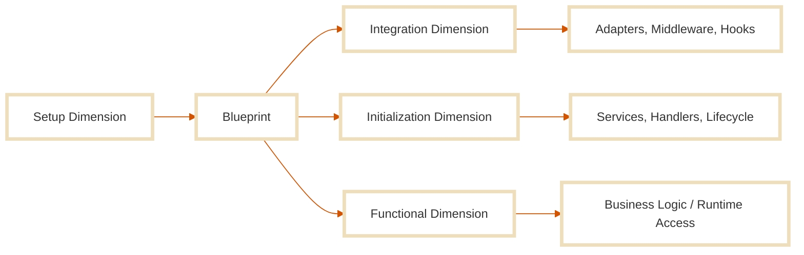
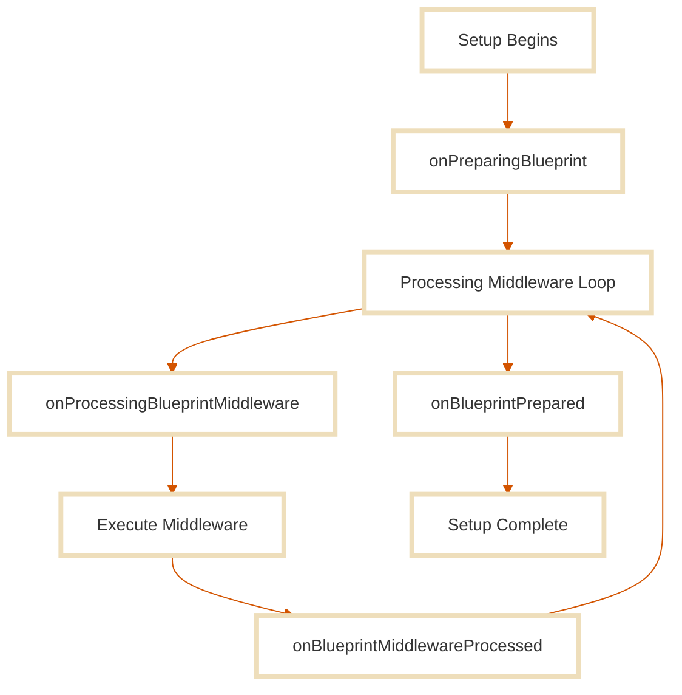

**The Blueprint is the centralized place where all configuration lives.**  
It is the output of the **Setup Dimension**, an object that defines the structure, components, and behaviors of your Stone.js system before it runs. It consolidates all declared modules, services, middleware, handlers, adapters, and more, and crucially, it is also where you register all configuration and settings your modules need to operate correctly.

This object is then passed along the rest of the system lifecycle. It’s available throughout the **Integration**, **Initialization**, and **Functional** dimensions, making it the cornerstone for building predictable, portable, and introspectable software across contexts.

The **Blueprint** is not frozen by default, it remains mutable. However, **mutating it at runtime is discouraged** unless absolutely necessary. It should be treated as a stable artifact once setup is complete. Mutation is possible, but it must be deliberate and controlled; the developer must understand the risks involved and the impact on system coherence.

### Why It Exists

Complex, cross-platform systems need a place to define what they are made of, and how they should behave. The Blueprint provides exactly that: a **declarative manifest** and **runtime instruction model**, separated cleanly from execution logic.

Without it, setup logic becomes fragmented across files, dimensions, and abstractions. With it, everything is unified:
- System configuration is centralized and introspectable
- Dependencies and features are organized and declared up-front
- Dynamic behavior remains possible through middleware and hooks

Whether your system runs on Node.js, in the browser, or in a FaaS environment, the Blueprint ensures every component is composed consistently and logically.

### Where It Fits in the Continuum

In the Continuum Architecture, the Blueprint is built only once, in the **Setup Dimension**, and made **accessible in all other dimensions**. It does not *drive* those dimensions directly, but it provides the necessary context and configuration to operate within them.



- It is passed into the **Integration Dimension**, enabling adapters, middleware, and hooks to introspect the system’s structure and settings.
- It is also passed into the **Initialization Dimension**, making it available inside services, handlers, lifecycle hooks, and modules.
- During runtime, any module can access the Blueprint to retrieve configurations or references established during setup.

This cross-dimensional accessibility is what enables Stone.js to unify runtime behavior across platforms, all through a consistent, introspected, and purpose-driven configuration model.

In short:
  - The Setup Dimension builds the Blueprint.  
  - The Blueprint supports the entire system.  
  - And every dimension can reach into it to understand what’s been configured.

## Blueprint API

The **Blueprint** is an instance of the `Config` class, a configuration registry built by the Setup Dimension and shared across all others.

### Working with Configuration

The Blueprint provides a set of methods to manage configuration values. These methods are designed to be simple and intuitive, allowing you to easily **retrieve**, **set**, and **manipulate configuration data**.

#### `get(key, default?)`

Returns the configuration value at the given key. This is the most used method across all dimensions.

```ts
blueprint.get('stone.name') // "MyStoneApp"
blueprint.get('stone.secret', 'default-secret') // default value
```

#### `set(key, value)`

Adds or overrides a value. Can be used during setup or runtime (use cautiously).

```ts
blueprint.set('stone.env', 'production')
blueprint.set('myApp.name', 'StoneBlog')
```

#### `setIf(key, value)`

Sets a value only if not already present.

```ts
blueprint.setIf('stone.debug', true)
```

#### `add(key, value)`

Appends a value to an existing array, plain object or list-based config.

```ts
blueprint.add('stone.services', MyService)
```

If you're unsure whether a key exists, always wrap the value in an array. This ensures compatibility with array-based namespaces and prevents configuration errors.

```ts
blueprint.add('stone.services', [MyService])
```

#### `has(key)`

Checks if a config key is defined.

```ts
if (blueprint.has('stone.secret')) { ... }
```

#### `firstMatch(keys, default?)`

Finds the first key that returns a value.

```ts
blueprint.firstMatch(['stone.secret', 'auth.secret'], 'default-secret')
```

#### `getMany(keys)`

Retrieve multiple values at once.

```ts
blueprint.getMany(['stone.name', 'stone.env'])
```

#### `all()`

Get the full config as a plain object.

```ts
console.log(blueprint.all())
```

#### `toJson()`

Get the config as a JSON string.

```ts
console.log(blueprint.toJson())
```

### Namespaces and Structure

Stone.js uses **dot-notation** keys to organize config into namespaces. This structure allows modules to cleanly isolate their settings.

You can define:
- **Built-in namespaces** → must live under `stone.*`
- **Custom namespaces** → can be anything you want

```ts
blueprint.set('stone.kernel.skipMiddleware', true) // built-in namespace
blueprint.set('auth.jwt.secret', 'abc123') // custom namespace
```

#### Example: Declaring Custom Config

```ts
blueprint.set('myApp.title', 'Stone Powered')
blueprint.get('myApp.title') // 'Stone Powered'
```

#### Access via Proxiable

The Blueprint extends `Proxiable`, which means you can directly access top-level keys like:

```ts
blueprint.stone        // ✅
blueprint.stone.kernel // ❌ (nested inside stone.kernel)
```

Only the **first level** of keys is accessible this way. To access nested values, always use the `get()` method:

```ts
blueprint.get('stone.kernel.middleware')
```

### Core Namespaces

Here’s a list of common built-in namespaces under `stone.*`. This list is **not exhaustive**, each module can define its own.

| Namespace                                   | Dimension      | Purpose                            |
| ------------------------------------------- | -------------- | ---------------------------------- |
| `stone.name`                                | Global         | Application name                   |
| `stone.env`                                 | Global         | Environment mode (dev/prod/test)   |
| `stone.debug`                               | Global         | Debug toggle                       |
| `stone.timezone`, `stone.locale`            | Global         | Regional settings                  |
| `stone.fallback_locale`                     | Global         | Locale fallback                    |
| `stone.secret`                              | Global         | Encryption key                     |
| `stone.blueprint.middleware`                | Setup          | Setup middleware list              |
| `stone.blueprint.defaultMiddlewarePriority` | Setup          | Default priority for middleware    |
| `stone.adapter`                             | Integration    | Current adapter config             |
| `stone.adapter.middleware`                  | Integration    | Middleware for the current adapter |
| `stone.adapters`                            | Integration    | All adapters used                  |
| `stone.kernel`                              | Initialization | Handlers, middleware, resolvers    |
| `stone.kernel.middleware`                   | Initialization | Middleware to register             |
| `stone.services`                            | Initialization | Services to register               |
| `stone.providers`                           | Initialization | Providers to register              |
| `stone.aliases`                             | Initialization | Class aliases                      |
| `stone.listeners`, `stone.subscribers`      | Initialization | Event handlers                     |
| `stone.logger`                              | Initialization | Logging and error reporting        |
| `stone.lifecycleHooks`                      | Initialization | Hooks for lifecycle observation    |
| `stone.liveConfigurations`                  | Initialization | Runtime-refreshed config           |


## Blueprint Configuration

Once your system starts, the **Setup Dimension** builds the **Blueprint**, and this is your chance to define exactly what your system should look like. You can configure the Blueprint [**statically**](#static-configuration) (without control over timing) 
or [**dynamically**](#dynamic-configuration-with-middleware) (using setup middleware, with full control over execution order and logic).

This section explains how to register values, modules, services, middleware, and anything else your system needs, either **declaratively** or **imperatively**.

### Static Configuration

Static configuration is the simplest way to **configure the Blueprint**. It allows you to define values and register modules during the setup phase, without controlling the execution order. This method is ideal for straightforward or constant configuration logic that doesn’t require introspection or conditional behavior.

::: tabs#declarative-imperative
@tab:active Declarative

#### Declarative

To configure the Blueprint declaratively, use the `@Configuration()` decorator. This decorator marks a class that exposes a `configure(blueprint)` method, called automatically during the setup process.

```ts
import { Configuration, IConfiguration, IBlueprint } from '@stone-js/core'

@Configuration()
export class MyConfig implements IConfiguration {
  configure(blueprint: IBlueprint) {
    blueprint.set('stone.name', 'MyStoneApp')
  }
}
```

The `configure` method can also be asynchronous:

```ts
import { fetchSettings } from './settings'
import { Configuration, IConfiguration, IBlueprint } from '@stone-js/core'

@Configuration()
export class MyConfig implements IConfiguration {
  async configure(blueprint: IBlueprint) {
    const settings = await fetchSettings()
    blueprint.set('stone.name', settings.name)
  }
}
```

##### Built-in Decorators

Many features in Stone.js offer their own decorators. For example, `@Service()`, `@Hook()`, `@Middleware()`, etc., these often register themselves into the Blueprint automatically. Use `@Configuration()` only when no feature-specific decorator exists, or when you need to customize the configuration values.

**`@StoneApp()`**

The special decorator `@StoneApp()` used to define the main entry point of your application, can also initialize the system directly:

```ts
@StoneApp({ name: 'myapp' })
export class Application {}
```

This is equivalent to setting `blueprint.set('stone.name', 'myapp')`.

@tab Imperative

#### Imperative

In an imperative setup, use the `defineBlueprintConfig()` utility to configure the Blueprint directly.

```ts
import { defineBlueprintConfig, IBlueprint } from '@stone-js/core'

export const appBlueprint = defineBlueprintConfig((blueprint: IBlueprint) => {
  blueprint.set('stone.name', 'MyStoneApp')
})
```

You can perform async setup here as well:

```ts
import { fetchSettings } from './settings'
import { defineBlueprintConfig, IBlueprint } from '@stone-js/core'

export const appBlueprint = defineBlueprintConfig(async (blueprint: IBlueprint) => {
  const settings = await fetchSettings()
  blueprint.set('stone.name', settings.name)
})
```
:::

### Dynamic Configuration

**Setup middleware** (also called **Blueprint middleware**) allows you to configure the **Blueprint** dynamically. This gives you full control over the execution flow and lets you introspect modules, apply conditional logic, or modify structure based on other config.

::: important
Setup middleware runs once during the Setup Phase, before any request is received.
:::

Setup middleware receives a `BlueprintContext`:

```ts
interface BlueprintContext {
  readonly blueprint: IBlueprint
  readonly modules: Array<ClassType | PipeClass>
}
```

::: tabs#declarative-imperative
@tab:active Declarative

#### Declarative

To register a setup middleware declaratively, use the `@ConfigMiddleware()` decorator:

```ts
import { ConfigMiddleware, BlueprintContext, IBlueprint, ClassType, NextMiddleware } from '@stone-js/core'

@ConfigMiddleware({ priority: 10 })
export class MySetupMiddleware {
  async handle (
    context: BlueprintContext<IBlueprint, ClassType>,
    next: NextMiddleware<BlueprintContext<IBlueprint, ClassType>, IBlueprint>
  ): Promise<IBlueprint> {
    const blueprint = await next(context)
    
    if (blueprint.get('stone.adapter.platform') === 'browser') {
      blueprint.add('stone.adapter.middleware', [{ module: MyMiddleware, isClass: true }])
    }

    return blueprint
  }
}
```

This example adds an integration middleware *only if* the selected platform is the browser, perfect for cross-platform configurations.

@tab Imperative

#### Imperative

You can register setup middleware imperatively by adding them to `stone.blueprint.middleware` namespace.

```ts
import { defineBlueprintConfig, BlueprintContext, IBlueprint, ClassType, NextMiddleware } from '@stone-js/core'

// Define the setup middleware
const MySetupMiddleware = async (
  context: BlueprintContext<IBlueprint, ClassType>,
  next: NextMiddleware<BlueprintContext<IBlueprint, ClassType>, IBlueprint>
): Promise<IBlueprint> => {
  const blueprint = await next(context)

  if (blueprint.get('stone.adapter.platform') === 'browser') {
    blueprint.add('stone.adapter.middleware', [{ module: MyMiddleware, isClass: true }])
  }

  return blueprint
}

// Register the setup middleware
export const appBlueprint = defineBlueprintConfig((blueprint: IBlueprint) => {
  blueprint.add('stone.blueprint.middleware', [{ module: MySetupMiddleware }])
})
```

This example adds an integration middleware *only if* the selected platform is the browser, perfect for cross-platform configurations.

:::

### Live Configuration

By default, all Blueprint configuration is loaded **once** at application startup and remains static for the lifetime of the system.

**Live configuration** allows you to define logic that re-runs and updates the blueprint **at every request**. This is useful when settings change dynamically (e.g., database-driven config, tenant-specific options) and must take effect immediately, without restarting the system.

You can define live configuration both **declaratively** and **imperatively**.

::: tabs#declarative-imperative
@tab:active Declarative
#### Declarative Live Configuration

Use the `@Configuration()` decorator with `{ live: true }`:

```ts
import { fetchSettings } from './settings'
import { Configuration, IConfiguration, IBlueprint } from '@stone-js/core'

@Configuration({ live: true })
export class MyConfig implements IConfiguration {
  async configure(blueprint: IBlueprint) {
    const settings = await fetchSettings()
    blueprint.set('stone.name', settings.name)
  }
}
```

This configuration will be re-applied before each request, allowing values like `stone.name` to reflect up-to-date external sources.

@tab Imperative

#### Imperative Live Configuration

Register a configuration module under the `stone.liveConfigurations` namespace:

```ts
import { fetchSettings } from './settings'
import { defineBlueprintConfig, IBlueprint } from '@stone-js/core'

const liveConfig = async (blueprint: IBlueprint) => {
  const settings = await fetchSettings()
  blueprint.set('stone.name', settings.name)
}

export const appBlueprint = defineBlueprintConfig((blueprint: IBlueprint) => {
  blueprint.add('stone.liveConfigurations', [liveConfig])
})
```

Each live configuration module runs independently on every request, ensuring your Blueprint reflects the most current data or environment.
:::

### Meta Modules and Imperative Utilities

When working with the **imperative API**, you interact directly with Stone.js’s meta module system, a low-level, flexible system based on **metaprogramming**. This system is transparent in the declarative API (via decorators), but in the imperative world, **you build and register meta modules yourself**.

#### Meta Modules

A meta module is a small descriptor object that tells the system what type of module you're registering.

```ts
interface MetaModule {
  module: any
  isClass?: boolean
  isFactory?: boolean
}
```

You must use the correct flag to describe the shape of the module:

###### Class module

```ts
blueprint.add('stone.kernel.middleware', [
  { module: MyMiddleware, isClass: true }
])
```

###### Factory module

```ts
blueprint.add('stone.kernel.middleware', [
  { module: createMiddleware, isFactory: true }
])
```

###### Function module (default)

```ts
blueprint.add('stone.kernel.middleware', [MyMiddleware])
// or explicitly
blueprint.add('stone.kernel.middleware', [
  { module: MyMiddleware }
])
```

::: important
You must always use `add()` with an array of modules for array-based namespaces. If the target namespace does not yet exist, the array will be initialized automatically.
:::

#### Imperative Utilities

To simplify the registration of meta modules, Stone.js provides utility functions that wrap your modules and assign the proper metadata automatically.

These are especially useful when working with **handlers**, **services**, **providers**, and **middleware**.

| Utility                          | Dimension      | Purpose                                                    |
| -------------------------------- | -------------- | ---------------------------------------------------------- |
| `defineBlueprintConfig()`        | Setup          | Add configuration to the Blueprint                         |
| `defineFactoryService()`         | Initialization | Return a meta service for registration                     |
| `defineFactoryServiceProvider()` | Initialization | Return a meta service provider for registration            |
| `defineFactoryMiddleware()`      | Initialization | Return a meta factory-based middleware for registration    |
| `defineClassMiddleware()`        | Initialization | Return a meta class-based middleware for registration      |
| `defineFactoryEventHandler()`    | Initialization | Return a meta event handler for registration               |
| `defineErrorHandler()`           | Initialization | Return a meta error handler for registration               |
| `defineFactoryErrorHandler()`    | Initialization | Return a meta factory-based error handler for registration |
| `defineAdapterErrorHandler()`    | Intregation    | Return a meta adapter error handler for registration       |
| `defineFactoryEventListener()`   | Initialization | Return a meta event listener for registration              |
| `defineFactoryEventSubscriber()` | Initialization | Return a meta event subscriber for registration            |

###### Example

Registering a functional middleware using a utility:

```ts
import { defineFactoryMiddleware } from '@stone-js/core'

blueprint.add('stone.kernel.middleware', [
  defineFactoryMiddleware(MyInitMiddleware)
])
```

If a utility function exists for your module type, prefer using it, it ensures consistency and reduces the chance of misconfigured metadata. When no utility is available yet, you can fall back to using `add()` with a properly formed meta module.

This low-level power is what makes the imperative API flexible and expressive. It lets you build your application exactly how you want, from scratch, while staying aligned with the Continuum Architecture.

### Let's Recap

You can configure the Blueprint in three ways:

- **Statically**, using decorators or `defineBlueprintConfig()` to set values once at startup.
- **Dynamically**, using setup middleware to introspect modules, apply logic conditionally, and control execution order.
- **Live**, using `@Configuration({ live: true })` or the `stone.liveConfigurations` namespace to reapply configuration on every request.

Use static configuration for simplicity and predictability.  
Use dynamic middleware when setup logic depends on discovered modules or runtime conditions.  
Use live configuration when values must reflect external changes without restarting the system.

## Setup Hooks

Setup hooks are lifecycle events triggered **only during the Setup Phase**. Their purpose is to give you visibility into the blueprint construction process, whether for logging, debugging, analytics, or performance tracking.



These hooks do **not** participate in modifying the system, they exist purely for **observability**.

::: important
If you need to modify the blueprint dynamically, use **setup middleware** instead.  
Hooks are for **observation only**.
:::

### Available Setup Hooks

| Hook                              | Type                | Description                                                              |
| --------------------------------- | ------------------- | ------------------------------------------------------------------------ |
| `onPreparingBlueprint`            | Global              | Triggered before the blueprint starts building. Useful for timing/debug. |
| `onBlueprintPrepared`             | Global              | Triggered once the blueprint is fully constructed.                       |
| `onProcessingBlueprintMiddleware` | Middleware-specific | Triggered before each middleware is processed.                           |
| `onBlueprintMiddlewareProcessed`  | Middleware-specific | Triggered after each middleware is processed.                            |

### Hook Context

Each setup hook provides a context object specific to its type.

#### Global setup hook context

Used by `onPreparingBlueprint` and `onBlueprintPrepared`.

```ts
interface BlueprintContext {
  readonly blueprint: IBlueprint
  readonly modules: Array<ClassType | PipeClass>
}
```

#### Middleware hook context

Used by `onProcessingBlueprintMiddleware` and `onBlueprintMiddlewareProcessed`.

```ts
interface BlueprintMiddlewareHookContext {
  passable: BlueprintContext
  pipe: PipeCustomInstance
  instance: PipeCustomInstance
  pipes: Array<MetaPipe>
}
```

### Registering Setup Hooks

You can register setup hooks using either the **declarative API** or the **imperative API**.

::: tabs#declarative-imperative
@tab:active Declarative

#### Declarative API

Use the `@Hook('<hookName>')` method decorator to register a hook. Hook methods can live in any class, but for clarity and separation of concerns, it's best to place them in a dedicated observer class or service provider.

```ts
import {
  Hook, BlueprintContext, BlueprintMiddlewareHookContext
} from '@stone-js/core'

export class BlueprintObserver {
  @Hook('onBlueprintPrepared')
  blueprintReady({ blueprint }: BlueprintContext) {
    console.log('Blueprint is ready:', blueprint.get('stone.name'))
  }

  @Hook('onProcessingBlueprintMiddleware')
  logEachMiddleware({ pipe }: BlueprintMiddlewareHookContext) {
    console.log(`Running: ${pipe.module.name}`)
  }
}
```

Hook methods are executed via reflection. They are **not** tied to class lifecycle, avoid using `this`.

@tab Imperative

#### Imperative API

Register hooks manually using `defineBlueprintConfig()` and the `blueprint.add()` method.

```ts
import {
  defineBlueprintConfig, BlueprintContext, BlueprintMiddlewareHookContext
} from '@stone-js/core'

const logReady = ({ blueprint }: BlueprintContext) => {
  console.log('Blueprint ready:', blueprint.get('stone.name'))
}

const logMiddleware = ({ pipe }: BlueprintMiddlewareHookContext) => {
  console.log(`Running middleware: ${pipe.module.name}`)
}

export const appSetupBlueprint = defineBlueprintConfig((blueprint) => {
  blueprint
    .add('stone.lifecycleHooks.onBlueprintPrepared', [logReady])
    .add('stone.lifecycleHooks.onProcessingBlueprintMiddleware', [logMiddleware])
})
```
:::

That’s it. Setup hooks give you powerful insight into how your system is assembled, without affecting behavior. Use them to instrument your system early and catch issues before runtime.

## Best Practices

Working with the Blueprint gives you full control over your system's configuration. The following practices will help you keep it clean, consistent, and maintainable:

#### Use Namespaced Keys

Organize all configuration using meaningful, dot-notation keys.

```ts
blueprint.set('auth.jwt.secret', '...')
blueprint.set('stone.logger.level', 'debug')
```

- Use the `stone.*` namespace for all built-in and core configurations.
- Use custom namespaces (e.g. `auth.*`, `myApp.*`) for project-specific or third-party modules.

#### Prefer Static Configuration When Possible

Use static configuration (`@Configuration`, `defineBlueprintConfig`) for simple, constant values that don’t depend on runtime discovery.

It’s easier to read, faster to process, and encourages declarative design.

#### Use Setup Middleware for Dynamic Logic

If your configuration depends on conditions, external input, or module introspection, use setup middleware.

```ts
@ConfigMiddleware()
export class MySetupMiddleware {}
```

Middleware gives you:
- Execution order control via `priority`
- Access to all discovered modules
- The ability to modify the blueprint based on context

#### Avoid Runtime Mutations

While the Blueprint is mutable, it is designed to be constructed once and used across dimensions. Avoid modifying it at runtime unless absolutely necessary.

If you must mutate it, document the reasoning clearly and isolate the change.

#### Avoid `this` in Hooks

Hook methods are called via reflection, independently of any class lifecycle. Do not rely on `this` in hook methods, prefer static logic or external utilities.

#### Use Utility Functions for Clarity

Use blueprint utility functions like `defineFactoryMiddleware()` or `defineFactoryService()` to register meta modules cleanly.

```ts
blueprint.add('stone.kernel.middleware', [
  defineFactoryMiddleware(MyInitMiddleware)
])
```

These helpers reduce boilerplate and make intent explicit.

#### Keep Hook Logic Lightweight

Setup hooks are for **observation only**. Avoid using them for any mutation or heavy logic.

Use them for:
- Logging
- Metrics
- Timing
- Debugging system setup behavior

#### Document Your Custom Namespaces

If you define your own configuration structure, document it clearly for future contributors. This ensures consistent usage and easier onboarding.

Following these practices ensures your blueprint remains structured, predictable, and introspectable, keeping your Stone.js system aligned with the Continuum Architecture.

## Summary

The Blueprint is the foundation of your Stone.js system. It defines all configurations, registered modules, middleware, lifecycle hooks, and services, built once during setup, then accessed across all dimensions.

You can populate the Blueprint in three primary ways:

- **Statically**, using `@Configuration()` or `defineBlueprintConfig()` to set values during setup
- **Dynamically**, using setup middleware to introspect and register modules based on context
- **Live**, using `@Configuration({ live: true })` or the `stone.liveConfigurations` namespace to reapply configuration on every request.

You can also observe the setup process using **Setup Hooks**, which allow you to track the blueprint's construction without mutating it.

For imperative applications, the `defineBlueprintConfig()` function can be used **anywhere** to register values, hooks, services, and modules. However, there must be **one and only one** call to `defineBlueprintConfig` that acts as the **main entry point**.

This entry-point Blueprint must be explicitly imported and set as the root of the system:

```ts
import { defineBlueprintConfig, stoneBlueprint } from '@stone-js/core'

export const mainBlueprint = defineBlueprintConfig((blueprint) => {
  blueprint.set(stoneBlueprint)
})
```

Once defined, the Blueprint becomes your system’s introspectable, shareable configuration, powering every adapter, every request, and every dimension.