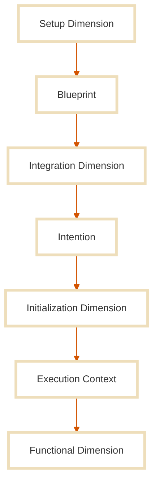

At the heart of Continuum Architecture lies a simple equation:

> **Application = Domain × Context → Resolution**

In this vision, **an application is not an object**, but an **event**: the act of applying structured domain logic to a real-world context in order to resolve an intention.  
This architecture treats both **domain** and **context** as first-class citizens, separated in design, inseparable in execution.

## Stone.js: The Runtime Context for Your Domain

Stone.js is not just a framework, it *is the context* itself.  
It implements the Continuum Architecture by taking full responsibility for the **contextual layers** of your system:

- **External context**: platform, environment, runtime, triggers  
- **Internal context**: context setup, adapter orchestration, service lifecycle  
- **Integration & initialization dimensions**: the flow from raw input to domain execution

Your job? **Write your domain logic.**  
Stone.js will handle how and where it runs.

> Instead of adapting your code to your environment,  
you let the environment express itself to your domain, through Stone.js.

Stone.js is the context that applies itself to the domain, not the other way around.

## Dimensions of Context in Stone.js

Continuum Architecture defines three contextual dimensions, all implemented in Stone.js:

1. **Setup**  
   Managed by `IBlueprintBuilder`. It builds a full context [blueprint](./blueprint) at runtime by introspecting your modules, dependencies, through [middleware](./blueprint#dynamic-configuration).

2. **Integration**  
   Handled by `IAdapter`. Specific to each environment (Browser, Server, FaaS, CLI, etc.), adapters capture **causes** (requests, commands, events) and transform them into **intentions** ([`IncomingEvent`](../essentials//incoming-event)).  
   These are passed to the system and ultimately produce **response** ([`OutgoingResponse`](../essentials/outgoing-response)), which the adapter sends back as **effects**. [Middleware](./adapter) can also participate in this transformation pipeline.

3. **Initialization**  
   This is where the **Kernel** applies the **Execution Context ([`Container`](./container))** to the **domain** according to the intention (`IncomingEvent`).
   [Middleware](./middleware) can intercept intentions **before they reach the domain**, modify them, validate them, or enrich them.

## Functional Dimension: Your Domain, Your Way

The **fourth dimension**, the **functional one**, belongs to you, the developer.

You define your business logic however you like, using the architecture, patterns, or libraries you trust. 
Stone.js doesn’t impose any structure, language(`JavaScript`/`TypeScript`), or paradigm. It simply ensures your domain logic is triggered at **the right time, with the right context, and receives the right data**.

Because **the problem is not the domain, the problem is the context.** And Stone.js solves it for you.

## Why It Matters Technically

This becomes especially relevant when you face common technical dilemmas:

- You want to run the same app **locally**, on a **server**, in **serverless (FaaS)**, or at the **edge**, without changing the code.
- You need to **learn and wire different frameworks specific** to Node HTTP, React, Vue, etc. just to deliver the same business logic on frontend and backend.
- You're constantly adapting to different runtimes and APIs when all you're trying to do is apply your domain logic.

**Stone.js abstracts that away.**

Use whatever UI you like. Deploy wherever you want. Write your domain logic once, and Stone.js will apply the context dynamically at runtime.

> Just write the app you mean.  
> Let Stone.js figure out how and where to run it.

## Want to Go Deeper?

Continuum Architecture is not just a technical trick, it’s a mindset.  
If you want to explore the philosophy behind it and see how it redefines what we call “an application,” 
read the full [Continuum Architecture Manifesto](https://evens-stone.github.io/continuum-manifesto/manifesto).
