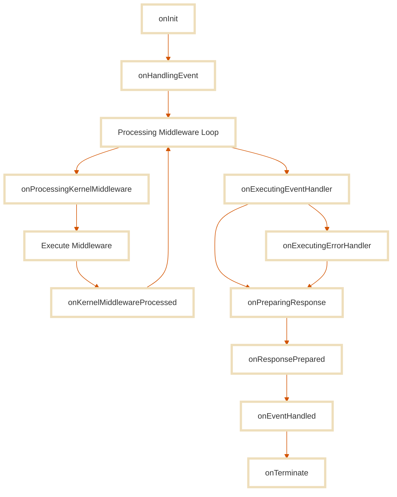

In Stone.js, a **lifecycle hook** is a listener function that is executed at a specific point in the evolution of the internal context. Hooks provide a structured way to observe what happens inside the system without altering its behavior. They are deeply integrated into the Continuum Architecture, where every application act is scoped within a dynamic, dimension-driven context.

Lifecycle hooks are dimension-scoped: each dimension in the context has its own set of hook points corresponding to its responsibilities. This makes hooks highly predictable and composable. They allow you to instrument and monitor the system at various phases, whether at boot time, per request, or during teardown.

However, hooks are strictly **observational**. They are not meant to intercept, control, or mutate context data. If you need to transform or intervene in the lifecycle of an intention or response, you must use middleware instead.

This page focuses specifically on the **initialization hooks**, the hooks triggered during the lifecycle of each **intention** (e.g., request, event, CLI input). These hooks allow you to trace and instrument everything that happens from the moment a request is received to the moment the response is finalized and the ephemeral execution context is destroyed.

Low-level lifecycle hooks related to [**setup**](./blueprint#setup-hooks) and [**integration**](./adapter#integration-hooks) dimensions will be documented separately.

## Initialization Hooks

The following hooks are executed during the lifecycle of each intention (e.g. HTTP request, CLI call, event trigger). These hooks are scoped to the **ephemeral execution context** and allow you to observe its evolution from creation to teardown.



Below is the full list of per-intent lifecycle hooks provided by the Initialization Dimension.


| Hook Name                      | When It Runs                                     | Typical Use Cases                                                     |
| ------------------------------ | ------------------------------------------------ | --------------------------------------------------------------------- |
| `onInit`                       | When the execution context is created            | Assign trace IDs, inject request-specific services, log start         |
| `onHandlingEvent`              | When the `IncomingEvent` is passed to the kernel | Track when the domain is about to be executed                         |
| `onProcessingKernelMiddleware` | Before each kernel middleware runs               | Log middleware order, start timing, setup middleware-specific context |
| `onKernelMiddlewareProcessed`  | After each kernel middleware completes           | Track execution time, collect metrics, debug effects                  |
| `onExecutingEventHandler`      | Just before the event handler runs               | Attach timing markers, wrap handler in observability logic            |
| `onExecutingErrorHandler`      | If the event handler throws an error             | Log and report exceptions, trigger alerts                             |
| `onPreparingResponse`          | Before preparing the internal response           | Normalize output, enrich response metadata                            |
| `onResponsePrepared`           | After the internal response is finalized         | Validate structure, inject post-processing metrics                    |
| `onEventHandled`               | After the domain logic is complete               | Log successful execution, audit events                                |
| `onTerminate`                  | When the request lifecycle ends                  | Cleanup, release resources, flush async tasks                         |

## Hook Listener Registration

In Stone.js, hook listeners can be registered in two ways:

- **Declaratively**, using the `@Hook()` decorator on a method
- **Imperatively**, using the `defineBlueprintConfig()` utility

Both approaches allow you to attach logic to any hook point in the system. However, the way hook listeners are resolved and executed reflects the architecture's introspective and flexible nature.

::: tabs#declarative-imperative
@tab:active Declarative
### Declarative Registration

You can declare hook listeners by annotating methods with the `@Hook('<hookName>')` decorator. This is the most common and readable way to bind custom behavior to lifecycle stages.

```ts
import { Hook } from '@stone-js/core';

export class LifecycleLogger {
  @Hook('onInit')
  logInit() {
    console.log('Execution context initialized.');
  }

  @Hook('onTerminate')
  cleanup({ event }) {
    console.log(`Event ${event.fingerprint(true)} ended`)
  }
}
```

**Where to declare hooks:**

- In the **application entrypoint class**
- In a **ServiceProvider** (we’ll see this in a later section)
- In **any other class**, but note the following:

Hook-decorated methods are **not tied to the class instance**. They are resolved **by reflection**, and may be invoked even if the class is never instantiated. Avoid using `this` or relying on instance state.

This ensures that hooks remain introspectable, context-agnostic, and safe to execute in isolated scopes.

@tab:active Imperative

### Imperative Registration

Hooks can also be registered manually in the blueprint definition. This approach is useful when you want full control over listener setup, for example, when registering hooks conditionally, injecting them dynamically, or composing from external libraries.

```ts
import { defineBlueprintConfig } from '@stone-js/core'

const logInit = () => console.log('Init triggered')
const logTerminate = ({ event }) => {
  console.log(`Event ${event.fingerprint(true)} ended`)
}

export const mainBlueprint = defineBlueprintConfig((blueprint) => {
  blueprint.add('stone.lifecycleHooks.onInit', [logInit])
  blueprint.add('stone.lifecycleHooks.onTerminate', [logTerminate])
})
```

This method attaches the listener directly to the context lifecycle under the `stone.lifecycleHooks.<hookName>` namespace.

**Use this approach when:**

- You need to register hooks **outside class structures**
- You want to **compose hooks dynamically**
- You are building **framework extensions or plugins**
:::

## Hook vs. Middleware

In Stone.js, both **hooks** and [**middleware**](./middleware) allow you to react to different stages of the context lifecycle, but they serve **fundamentally different purposes**.

Understanding this distinction is key to writing clear, maintainable, and continuum-aligned systems.

### Hooks: Observers

Hooks are passive. They are triggered automatically by the framework at well-defined execution points. They cannot interrupt the flow, short-circuit execution, or return alternative results. They exist **outside the pipeline**, and their purpose is to **observe and instrument** the context.

- Listen to internal events
- Measure performance
- Collect analytics
- Log execution
- Extend features in a modular way
- React to success/failure states

Hooks do not mutate the [`IncomingEvent`](../essentials/incoming-event), the [`OutgoingResponse`](../essentials/outgoing-response), or the execution pipeline. They are safe, side-effect-free tools for **observability and diagnostics**.

### Middleware: Participants

Middleware are active. They are part of the execution pipeline and can:

- Short-circuit the flow
- Modify the [`IncomingEvent`](../essentials/incoming-event) or [`OutgoingResponse`](../essentials/outgoing-response)
- Apply validation, authentication, or business-specific rules
- Catch and transform errors
- Inject data into the context

Middleware lives **inside the dimensions**, especially in the [**Setup**](./blueprint), [**Integration**](./adapter), and **Initialization** dimensions, and is responsible for shaping the behavior of the context.

They define **how** intentions are interpreted, and **what** happens in response.

### Comparison Table

| Feature                    | Hook                          | Middleware                         |
|----------------------------|-------------------------------|------------------------------------|
| Role                       | Observer                      | Participant                        |
| Execution scope            | Outside the pipeline          | Inside the pipeline                |
| Can mutate context?        | No                            | Yes                                |
| Can short-circuit flow?    | No                            | Yes                                |
| Access to `next()`         | No                            | Yes                                |
| Purpose                    | Monitoring, logging, metrics  | Behavior, transformation, control  |
| Typical usage              | Tracing, audit logs, cleanup  | Auth, validation, response shaping |

## Summary

Lifecycle hooks in Stone.js provide a structured, dimension-aware way to **observe** the internal evolution of the context, from system startup to per-intent execution and teardown.

They are:

- **Dimension-scoped**: Each hook is bound to a specific phase of the continuum
- **Passive**: Hooks cannot modify or interrupt the flow, they listen, they don’t act
- **Safe and isolated**: Hook execution is side-effect-tolerant and does not depend on class instantiation
- **Crucial for instrumentation**: Ideal for logging, tracing, performance measurement, debugging, and system introspection

In this documentation, we focused specifically on the **Initialization Dimension**, where per-intent hooks are triggered for each ephemeral execution context.

Hooks are registered using:

- `@Hook()` decorators for declarative class-based listeners
- `defineBlueprintConfig` for flexible, imperative registration

And most importantly:

> Use **hooks** when you want to observe what’s happening.  
> Use **middleware** when you want to control what happens.

If your code **returns**, **transforms**, or **decides**, it’s middleware.  
If your code just **records**, **measures**, or **responds after the fact**, it’s a hook.

To go deeper:
- Explore [**Setup Hooks**](./blueprint#setup-hooks) to instrument blueprint construction
- Explore [**Integration Hooks**](./adapter#integration-hooks) to track adapter-level behavior
- See the [**Middleware**](./middleware) documentation to learn how to intercept and control flow across dimensions

The more you align your instrumentation strategy with the Continuum, the more modular, observable, and resilient your application will become.
