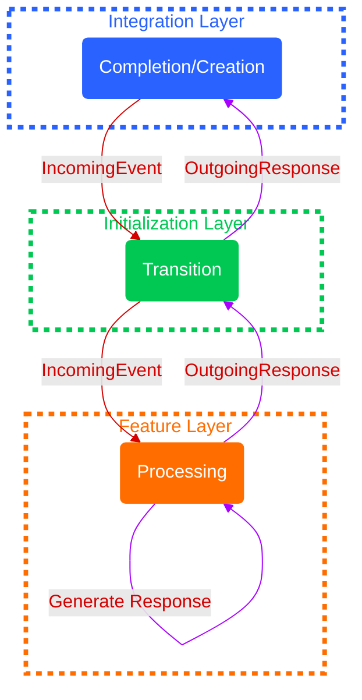

Events play a crucial role in a Stone.js ecosystem, acting as the transversal information element across almost all layers. Layers communicate with each other by sending and receiving events, significantly reducing the coupling between layers and components, allowing them to evolve independently.

In a Stone.js application, everything operates through events, including HTTP requests, CLI commands, module-triggered events, and even responses returned by Stone.js. One of the key characteristics of omnipresent applications is treating all inputs from different platforms as events and processing them accordingly. This approach ensures uniformity in inputs and outputs regardless of the environment or platform.

## Event Categories

There are two main categories of events within the Stone.js ecosystem:

- [External Events](#external-events): Represent all inputs and outputs from or to the platform.
- [Internal Events](#internal-events): Represent all events created and managed within the application, including those created by the user.

### External Events

External events are events originating from outside the Stone.js framework and are represented 
by the base classes `IncomingEvent` and `OutgoingResponse` which are both subclasses of `Event`.

#### `IncomingEvent`

All inputs from the platform are converted by the adapter at the integration layer via [adaptive transformation](../../cookbook/node-adapter/#adaptive-transformation) and are represented by the `IncomingEvent` class. Various specific classes extend this base class, such as `IncomingHttpEvent`, which represents an HTTP event in an HTTP application context.

#### `OutgoingResponse`

All Stone.js outputs directed towards the platform are represented by the `OutgoingResponse` class. Various specific classes extend this base class, such as `OutgoingHttpEvent`, which represents an HTTP response in an HTTP application context. This response is then converted into a platform-specific response by the adapter at the integration layer.

::: important Tips
These categories of events can only be intercepted via handlers, including route actions, specifically through controllers.
:::

This is precisely the purpose of the main handler or the router at the feature layer: to intercept and process `IncomingEvent` instances and return `OutgoingResponse` instances.

::: code-tabs#js
@tab:active JavaScript

```js
@StoneApp()
export class Application {
  handle (event) {
    return new OutgoingResponse()
  }
}
```

@tab TypeScript

```ts
@StoneApp()
export class Application {
  handle (event: IncomingEvent): OutgoingResponse {
    return new OutgoingResponse()
  }
}
```
:::

### Internal Events

Internal events include all application-specific events within Stone.js, such as `KernelEvent` from the kernel, as well as custom events created by the user.

::: important Tips
These categories of events can only be intercepted via listeners or subscribers.
:::

This topic will be explored in depth in the section dedicated to [Internal Events](../essentials/events.md).

## Event Lifecycle

The Event Lifecycle in Stone.js represents the complete journey of an external event from its creation to the final response.
Understanding this lifecycle is crucial for effectively working with the framework. 
Each layer in the lifecycle has specific hooks that are triggered before the reception of events and after the response is sent.



### Creation

1. **Integration Layer**:
  - **Role**: The event is created at the integration layer. Platform-specific inputs are converted into a Stone.js `IncomingEvent`.
  - **Hooks**:
    - `beforeHandle`: Triggered before the event is processed.
    - `onTerminate`: Triggered after the response is sent.

### Transition

2. **Initialization Layer**:
    - **Role**: Receives the event from the integration layer and propagates it to the main handler or router in the feature layer.
    - **Hooks**:
        - `beforeHandle`: Triggered before the event is processed.
        - `onTerminate`: Triggered after the response is sent.

### Processing

3. **Feature Layer**:
    - **Role**: Receives the event from the initialization layer, processes it, and creates a response (`OutgoingResponse`).
    - **Hooks**: 
        - `beforeHandle`: Triggered before the event is processed. 
        - `onTerminate`: Triggered after the response is generated.

### Completion

4. **Returning the Response**:
    - The response, created in the feature layer, is passed back to the initialization layer for any final processing.
    - It then moves to the integration layer, where it is transformed into a platform-specific output and sent back to the client.

### Summary

The Event Lifecycle ensures that events are consistently managed and processed across different layers of the Stone.js framework. Each layer's hooks (`beforeHandle` and `onTerminate`) provide points for pre-processing and post-processing, respectively. This structured approach allows for a clean separation of concerns, making the application more maintainable and scalable.

By understanding the Event Lifecycle and the associated hooks, developers can better utilize Stone.js to build robust, adaptable, and efficient applications.
