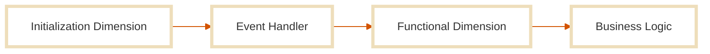
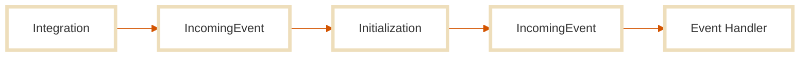

The **Event handler** is the core execution unit of every Stone.js application.  
It represents the precise moment when the domain finally meets the context, when your logic responds to a real-world intention.

In Stone.js, **all external interactions**—HTTP requests, CLI commands, WebSocket messages, MQTT events—are normalized as a single type: the [`IncomingEvent`](./incoming-event).  
And there's exactly **one** way to handle an incoming event: the **event handler**.

Each event handler receives the [`IncomingEvent`](./incoming-event) as its only parameter and may return a result, or not.  
This minimal contract allows Stone.js to remain completely adaptable, from tiny edge-deployed functions to complex applications with routers and dynamic flows.

### The Continuum Perspective

In the **Continuum Architecture**, context and domain form a dynamic relationship.  
Your domain should never assume full control over its context—nor should it ignore it completely. This tension is captured in the **uncertainty principle**:

> *“The domain cannot both fully know its execution context and remain independent from it.”*

The event handler embodies this principle.  
It accepts an [`IncomingEvent`](./incoming-event), reacts with domain logic, and produces an outcome—without ever binding itself to the raw source of that event.  
It doesn’t care whether the event came from HTTP, WebSocket, or a CLI—it just handles *intentions*, not mechanics.

### Where It Lives

The event handler belongs to the **initialization dimension** of Stone.js.  
It runs after your app is bootstrapped and ready to process a request.  
Every application **must** define at least one event handler—or it cannot react to incoming events at all.



By default, a Stone.js app has one event handler. If you need multiple entry points, use the [Router](../router) to delegate the right events to the right handlers.

## Variants and Execution

Stone.js supports **three variants** for defining event handlers:

- **Class-based** (recommended for declarative APIs and introspection)
- **Function-based** (ideal for quick scripts or nano apps)
- **Factory-based** (perfect when you need dependency injection via the container)

No matter the variant, the contract remains the same:  
You receive an `IncomingEvent` and optionally return a response.

::: tabs#class-factory-function
@tab:active Class-based
### Class-based Event Handler

If you prefer structure and decorators, this is the default variant.

Just implement the `handle` method from the `IEventHandler` interface:

```ts
import { IncomingEvent, IEventHandler } from "@stone-js/core"

export class Application implements IEventHandler<IncomingEvent> {
  handle(event: IncomingEvent): void {
    // Handle the event here
  }
}
```

This shape integrates seamlessly with the declarative API.

@tab Function-based
### Function-based Event Handler

For fast prototyping or single-purpose apps, you can write a simple function:

```ts
import { IncomingEvent } from "@stone-js/core"

const Application = (event: IncomingEvent): void => {
  // Handle the event here
}
```

Great for edge functions, CLI tools, or single-route logic.

@tab Function-based
### Factory-based Event Handler

Need access to the service container or runtime dependencies?  
Use a factory-based handler: a function that returns your actual handler function.

```ts
import { IContainer, IncomingEvent } from "@stone-js/core"

const Application = (container: IContainer) => {
  return (event: IncomingEvent): { message: string } => {
    const message = `Hello ${event.get<string>('name', 'World')}!!`
    return { message }
  }
}
```

This gives you full access to registered services at runtime, while keeping the handler itself focused.
:::

Each variant is valid and interchangeable.  
The choice depends on your app size, your preferred programming style, and how much framework-level automation you want.

## Execution Context & Event Lifecycle

Event handlers in Stone.js are executed within the **initialization dimension**, and they are called **once per incoming event**.  
Each time an external request (or message) reaches your system, the event handler is invoked with a normalized [`IncomingEvent`](./incoming-event) instance.



This is where intention meets behavior, your application, in the most literal sense, *happens* here.

### One Event, One Handler

Stone.js guarantees a **single point of entry** for handling each incoming event.  
Whether the event originates from HTTP, WebSocket, CLI, MQTT, or another integration, the event handler remains the only valid execution entry.

This consistency ensures that:

- Your domain logic remains isolated from transport concerns
- Your application remains portable and platform-agnostic
- You always deal with the same [`IncomingEvent`](./incoming-event) interface or its subclasses

### What You Receive

The handler always receives an [`IncomingEvent`](./incoming-event) or a subclass of it.

```ts
handle(event: IncomingHttpEvent): void {
  event.uri // The request URI
  event.body // The raw HTTP request body
  event.headers // The HTTP request headers
  event.params // The URL parameters
  event.query // The query string parameters as URLSearchParams
}
```

Which abstracts the raw request and wraps useful context like:

- Parameters
- Headers
- Payload/body
- Metadata
- And more...

This means you write one handler that works across environments, even across platforms.

### What You Can Return

Your handler can return:

`void`, if you’re doing something side-effectful or async
```ts
handle(event: IncomingHttpEvent): void {
  console.log(event.uri)
}
```

A **value**, which will be passed back as the final response
```ts
handle(event: IncomingHttpEvent): string {
  return 'Hello world!'
}
```

An **object**, which will be passed back as the final response
```ts
handle(event: IncomingHttpEvent): { message: string } {
  return { message: 'Hello world!' }
}
```

A **Promise**, if you’re doing async work (e.g., calling a database)
```ts
handle(event: IncomingHttpEvent): Promise<{ message: string }> {
  return Promise.resolve({ message: 'Hello world!' })
}
```

An [`OutgoingResponse`](./outgoing-response), if you want to have full control over the response body, status code, headers, etc.
```ts
handle(event: IncomingHttpEvent): OutgoingHttpResponse {
  return OutgoingHttpResponse.create({
    content: {
      message: 'Hello world!'
    }
  })
}
```

Stone.js will take care of response normalization based on the integration adapter (e.g., format the object as JSON in HTTP).

### What Happens Around the Handler

Before and after your event handler is called, the system may:

- Execute middleware (e.g., authentication, logging, transformations)
- Trigger lifecycle hooks (`onHandlingEvent`, `onEventHandled`, etc.)
- Manage error propagation (`onExecutingErrorHandler`)
- Build and finalize the response (`onPreparingResponse`, `onResponsePrepared`)

This means you can focus purely on **what the domain should do**, while Stone.js handles the infrastructure logic transparently.

## Registering the Event Handler

Stone.js offers **two ways** to register your event handler:

- Declarative API, using decorators and class-based modules
- Imperative API, using `defineBlueprintConfig` for manual control

No matter the shape (class, function, factory), the registration process makes your handler available to the kernel for runtime execution.

::: tabs#declarative-imperative
@tab:active Declarative
### Declarative Registration

This is the **simplest and most common** way to register an event handler.

If your application is class-based and uses the `@StoneApp()` decorator, all you need to do is implement the `handle()` method:

```ts
import { StoneApp, IncomingEvent, IEventHandler } from "@stone-js/core"

@StoneApp()
export class Application implements IEventHandler<IncomingEvent> {
  handle(event: IncomingEvent): void {
    // Do your logic here
  }
}
```

As soon as you decorate the class with `@StoneApp()`, the system recognizes it as your main application entrypoint and automatically wires up the event handler.

Note: You can only have **one main event handler** by default.  
For multiple handlers, see the [Router documentation](../router) to route events conditionally.

@tab Imperative
### Imperative Registration

Prefer full control or want to register a function/factory manually?  
Use the `defineBlueprintConfig` function and set the `stone.kernel.eventHandler` key.

#### Function-based Handler

```ts
export const AppBlueprint = defineBlueprintConfig((blueprint) => {
  blueprint.set('stone.kernel.eventHandler', { module: Application })
})
```

#### Factory-based Handler

If you're using a factory shape, add `isFactory: true`:

```ts
export const AppBlueprint = defineBlueprintConfig((blueprint) => {
  blueprint.set('stone.kernel.eventHandler', {
    module: Application,
    isFactory: true,
  })
})
```

This gives you low-level flexibility, useful for advanced bootstrapping or dynamic registration scenarios.
:::

In both modes, once registered, the framework ensures that the handler is executed for every `IncomingEvent` reaching your application.

## Router and Multi-Route Support

By default, a Stone.js application has **one event handler**. 
That’s perfect for nano-services, single-purpose FaaS functions, or CLI tools.
But what if your app needs to handle **multiple types of requests**, mapped to different logic? That’s where the [**Router**](../router/) comes in.

### One Handler by Default

Out of the box, the kernel expects a **single** event handler. 
It will receive every `IncomingEvent` and decide what to do.
This makes your app ultra-lightweight and cloud-ready, but limited to one entrypoint.

### Scaling with the Router

If your app needs to support:

- Multiple endpoints (e.g., `/users`, `/posts`)
- Different event types (e.g., HTTP vs. WebSocket)
- Modular handler definitions per domain

…then install the [**Router**](../router/) and use it to dispatch events to the appropriate handler.

The Router lives in the **initialization dimension**, just like event handlers. 
It intercepts incoming events and **routes them** to the correct handler, based on metadata like path, method, or headers.

```ts
@EventHandler('/users', { name: 'users' })
export class UserEventHandler {
  @Get('/', { name: 'list' })
  @JsonHttpResponse(206)
  async list(event: IncomingHttpEvent): Promise<UserResponse[]> {}

  @Get('/:user@id(\\d+)', { bindings: { user: UserService } })
  show(event: IncomingHttpEvent): UserResponse {}
}
```

Check out the [Router documentation](../router) to learn more about how to set it up and use it.

Stone.js lets you scale from **mono-handler** to **multi-handler** seamlessly, with no change to how event handlers are written.

## Dimension-Specific Behavior

In Stone.js, every component belongs to a **dimension** of the Continuum Architecture.  
The **event handler** is firmly rooted in the **initialization dimension**, the moment your system is fully built and ready to process intentions.

### Initialization-Only

Unlike setup-time configuration or integration-specific behavior, the event handler is:

- Created **after** the system is bootstrapped
- Executed **once per incoming event**
- Independent of the integration layer or platform

It is the final stage of the request lifecycle, the domain’s direct response to the external world.

### Platform-Agnostic

Thanks to the `IncomingEvent` abstraction, you can write **one handler** that works across:

- **HTTP** requests
- **CLI** commands
- **WebSocket** messages
- **MQTT** events
- And more…

The event handler doesn’t care how the event got in, only **what it means**.  
This allows your domain logic to stay pure, portable, and deployment-agnostic.

### No Setup or Integration Responsibilities

Event handlers do **not** participate in:

- **Setup dimension** tasks (e.g., registering services, adapters, middleware)
- **Integration dimension** operations (e.g., transforming raw input, mapping routes)

Those are handled before the event handler is even called.

Your handler's job is simple:  
**Receive the intention, interpret it, and reply.**

This is what makes Stone.js ideal for continuum-based, context-flexible applications, from mono-cloud systems to full systems.

## Best Practices

The event handler is **not a traditional controller**.  
It’s the **meeting point between intention and domain**, and it should remain as focused as possible.

Here’s how to get the most out of your event handlers in Stone.js:

#### 1. Keep It Thin

Your event handler should do exactly one thing:  
**Accept the incoming event and pass it along to the right part of your domain.**

Avoid writing business logic inside the handler, that’s what services, use cases, or domain modules are for.

```ts
handle(event: IncomingEvent) {
  return this.userService.createUser(event.content)
}
```

The thinner your handler, the easier it is to test, maintain, and reuse.

#### 2. Treat It Like a Function Entry Point

Think of your handler as a function signature for external input.

- Validate the event (if needed)
- Transform the input (if needed)
- Call into the domain
- Return the output

That’s it.  
No side quests, no side effects.

#### 3. Never Bind to Context-Specific APIs

Avoid direct calls to `req`, `res`, `process`, `console`, or anything else tied to a specific environment.  
Use the `IncomingEvent` and domain services to stay agnostic and portable.

#### 4. Compose With Middleware

If your handler is starting to grow:

- Move shared logic to middleware (auth, logging, headers)
- Move domain logic to services or use cases
- Let the handler just **orchestrate**

You’ll thank yourself when it’s time to scale or refactor.

#### 5. Prefer Class Shape for Declarative Use

If you're using the declarative API and `@StoneApp()`, use the **class-based handler**.  
It integrates naturally with introspection, decorators, and tooling.

#### 6. Use Factories for Container Access

If you need services or runtime config in your function-based handler, use the **factory shape**.  
That’s what it’s for.

```ts
const Handler = (container: IContainer) => {
  return (event) => {
    const auth = container.get(AuthService)
    return auth.authenticate(event)
  }
}
```

A clean handler is a scalable handler.  
Stick to the intention → domain → response model, and your apps will remain elegant and resilient.

## Summary

The **event handler** is the central execution point of every Stone.js application.  
It’s where context becomes meaningful, and the domain takes action.

Here’s what you should remember:

- It belongs to the **initialization dimension**
- It is the **only way** to handle an `IncomingEvent`
- It can be written as a **class**, **function**, or **factory**
- It can be registered **declaratively** (with `@StoneApp`) or **imperatively** (via `defineBlueprintConfig`)
- It runs **once per incoming event**, and may return a value, `void`, or a `Promise`
- It must stay **light**, **clean**, and **focused on delegation**
- It works identically across all platforms, thanks to the standardized `IncomingEvent`

Stone.js gives you one, and only one, entrypoint for application logic, because that’s all you need to build anything.

> One handler.  
> Infinite possibilities.  
> And absolutely zero assumptions about the platform.

Ready to handle some events?

