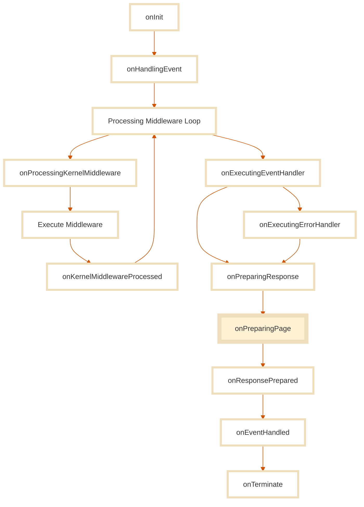

In Stone.js, a **page** is more than just a component. It’s a **context-aware unit of interaction** that responds to a route and participates in the full application lifecycle, before, during, and after rendering.

Unlike other frameworks where pages are just UI components mapped to paths, Stone.js pages are built on top of the **event handler model**. That means every page:

* Is an **event handler**, and benefits from dependency injection, middleware, lifecycle hooks, and introspection.
* Has access to **Incoming Events** (from the browser or server).
* Can return **responses**, snapshots, or errors.
* Can handle rendering via a **React functional component**.

This gives you full control over how data is fetched, how views are rendered, and how the system responds, **without mixing concerns**.

### Not just another component

::: important
A page is not a **React class component**. 
:::

It's **not** just a function returning JSX. It's an **architectural unit**.

```ts
@Browser()
@UseReact()
@StoneApp()
export class Application implements IComponentEventHandler<ReactIncomingEvent> {
  constructor(private readonly container: IContainer) {}

  handle(event: ReactIncomingEvent): { message: string } {
    return { message: 'Hello world!' }
  }

  render({ data }: RenderContext<{ message: string }>): ReactNode {
    return <h1>{data?.message}</h1>
  }
}
```

You can define it in a class, a factory, or even with runtime logic, but once registered, it's a route-aware, lifecycle-managed handler that decides what to render and how to behave.

This separation of concerns, between the **system** (Stone.js) and the **view** (React), is what makes this integration uniquely robust.

## Defining Pages

Stone.js gives you the freedom to define your pages in the way that best fits your application architecture. Whether you prefer a class-based structure or a factory function, the goal is the same: **respond to an event, and render a view.**

Every page in Stone.js is an **event handler** that implements the `IComponentEventHandler` interface. This interface provides:

* A `handle` method to process incoming events (optional)
* A `render` method to return the React component (required)

No matter which shape you choose, the rendering logic must always return a **React functional component**. This ensures compatibility with both server and browser environments.

::: tabs#class-factory-function
@tab:active Class-based
### Class-based Pages

This is the most introspectable and declarative approach. It integrates perfectly with the decorator-based API and provides clear separation of concerns.

```ts
import { IComponentEventHandler, ReactIncomingEvent } from '@stone-js/use-react'

export class HomePage implements IComponentEventHandler<ReactIncomingEvent> {
  handle(event: ReactIncomingEvent): any {
    // Handle the incoming event, fetch data, etc.
    return { message: 'Hello world!' }
  }

  render({ data }: RenderContext<{ time: string }>): ReactNode {
    return <div>{data?.message}</div>
  }
}
```

Use this shape when you want lifecycle hooks, clear structure, or plan to use the `@Page()` decorator for route registration.

@tab Factory-based
### Factory-based Pages

Factory pages allow you to define your logic dynamically and resolve dependencies from the service container at runtime.

```ts
import { IContainer } from '@stone-js/core'
import { ReactIncomingEvent } from '@stone-js/use-react'

export const HomePage = (container: IContainer) => {
  return {
    handle(event: ReactIncomingEvent) {
      // Use services from container
      return { message: 'Hello world!' }
    },

    render({ data }: RenderContext<{ time: string }>): ReactNode {
      return <div>{data?.message}</div>
    }
  }
}
```

This approach is ideal for use cases where you need full control over construction, or want to register pages imperatively.
:::

Both class-based and factory-based pages are **first-class citizens** in Stone.js. You can mix and match them freely based on the needs of each module or route.

The key difference is in **how you register them**, which we’ll cover next.

## Registering Pages

Once your page is defined, whether as a class or a factory, you need to register it so Stone.js can associate it with a route.

There are two ways to register a page:

* The **declarative API**, using decorators (for class-based pages)
* The **imperative API**, using `definePage()` (for any shape)

Both approaches support the same options, such as `path`, `name`, `layout`, and route guards. Choose the one that fits your style or runtime needs.

::: tabs#declarative-imperative
@tab:active Declarative
### Declarative Registration

The declarative API is the cleanest way to define a page when using a class. Just decorate your class with `@Page()`, and provide the path and any desired options.

```ts
import { Page, IComponentEventHandler, ReactIncomingEvent } from '@stone-js/use-react'

@Page('/home', { name: 'home' })
export class HomePage implements IComponentEventHandler<ReactIncomingEvent> {
  handle(event: ReactIncomingEvent): any {
    return { message: 'Hello world!' }
  }

  render({ data }: RenderContext<{ time: string }>): ReactNode {
    return <div>{data?.message}</div>
  }
}
```

This approach automatically makes the page lazy-loaded and discoverable by the router during the setup phase.

@tab Imperative
### Imperative Registration

If you’re using factory-based pages or want more control over registration, you can use the imperative API with `definePage()`.

```ts
import { definePage } from '@stone-js/use-react'

export const HomePage = (container: IContainer) => {
  return {
    handle(event: ReactIncomingEvent) {
      return { message: 'Hello world!' }
    },

    render({ data }: RenderContext<{ time: string }>): ReactNode {
      return <div>{data?.message}</div>
    }
  }
}

// Register in your blueprint
blueprint.set(definePage(HomePage, {
  name: 'home',
  path: '/home'
}, true))
```

The third argument (`true`) indicates a factory page. If you set it to `false`, Stone.js will treat it as a class-based page.
:::

Whichever registration style you choose, once the page is connected, Stone.js will:

* Match it to incoming routes
* Apply lifecycle hooks
* Provide the correct context
* Handle rendering, snapshotting, and error delegation

### Lazy Loading

Stone.js fully supports **lazy loading** for pages. This ensures that only the necessary code is loaded when a route is accessed, boosting performance and reducing initial bundle size.

::: tabs#declarative-imperative
@tab:active Declarative
#### Declarative API: Lazy by default

When you use the declarative API with `@Page()`, lazy loading is automatically enabled. You don’t have to configure anything, Stone.js takes care of dynamic imports behind the scenes.

This allows you to organize your pages however you like, without worrying about splitting them manually.

```ts
@Page('/about', { name: 'about' })
export class AboutPage implements IComponentEventHandler<ReactIncomingEvent> {
  render(): React.ReactNode {
    return <div>About Us</div>
  }
}
```

Behind the scenes, Stone.js will only load this page when the `/about` route is activated.

@tab Imperative
#### Imperative API: You manage it manually

When using the imperative API, **lazy loading is not automatic**. You must handle it yourself by:

1. Returning a dynamic `import()` function that resolves to the page module.
2. Setting the `lazy: true` flag in the `definePage()` options.

Here’s how:

```ts
definePage(
  () => import('./HomePage').then(v => Object.values(v)[0]),
  {
    name: 'home',
    path: '/home',
    lazy: true
  },
  true
)
```

Let’s break that down:

* `() => import('./HomePage')` returns a Promise of the module.
* `Object.values(v)[0]` extracts the first export from the module (your page).
* The `lazy: true` flag tells Stone.js this is a deferred page, loaded on demand.

Because the import must resolve to a single page handler, you should place **one page per file** to avoid ambiguity.
:::

Stone.js gives you full control: **automatic lazy loading when you want it**, and **manual control when you need it**.

## Page Lifecycle

Every page in Stone.js lives at the intersection of two systems:

* The **functional core**, powered by Stone.js: event handling, routing, lifecycle orchestration, service injection, and snapshots.
* The **view layer**, powered by React: component rendering, hooks, state, and the DOM.

The **page lifecycle** defines when and how these two systems interact. It ensures that before React renders anything, Stone.js has already prepared the context, resolved the data, and performed all architectural responsibilities.

::: important
Once the page is rendered, Stone.js steps back, and React takes full control.
:::

### The lifecycle in two acts

Stone.js separates the page lifecycle into two distinct phases:

| Phase    | Responsibility                                                      | Powered by                   |
| -------- | ------------------------------------------------------------------- | ---------------------------- |
| `handle` | Intercept the incoming event, fetch data, validate, return response | Stone.js (functional domain) |
| `render` | Return a JSX tree (React functional component)                      | React (view layer)           |

This clear separation of responsibilities is key to the Continuum:

* The `handle()` method speaks to the **backend** of the page: it's where you handle the incoming event, fetch data, access services, and optionally return a value.
* The `render()` method speaks to the **frontend**: it receives the resolved data, the event, the container, and behaves like a true React functional component.

```ts
export class HomePage implements IComponentEventHandler<ReactIncomingEvent> {
  handle(event: ReactIncomingEvent) {
    return { user: { name: 'Stone' } }
  }

  render({ data, event, container }: RenderContext) {
    const user = data.user
    return <h1>Hello {user.name}</h1>
  }
}
```

The `render()` method is called after the functional phase is complete. It has **no side effects**, just UI logic. It behaves like a **pure React component**, with full access to the event, the resolved data, and any services registered in the container.

This model enables true decoupling between **data logic** and **UI logic**, paving the way for powerful features like snapshots, error isolation, and clean hydration.

### Why separate `handle` and `render`?

At first glance, you might wonder: why not just return JSX from the `handle()` method?

The answer lies in architecture.

* `handle()` is part of the **Stone.js functional pipeline**, it belongs to the application logic.
* `render()` is part of the **React runtime**, it belongs to the view layer.

Keeping them separate allows:

* Cleaner lifecycle control
* Better debugging and introspection
* Optimized SSR with automatic **snapshot hydration**
* Independent evolution of logic and view
* Support for server-only rendering (SOR), where the view is computed once and never hydrated

In short: **different responsibilities deserve different roles**.

### Stone.js lifecycle ends at render

Stone.js orchestrates everything **until** the page is rendered.

* It handles the routing.
* It processes the incoming event.
* It runs middleware.
* It executes lifecycle hooks.
* It manages snapshots and errors.
* And then... it renders.

Once the `render()` method returns a JSX tree, the **Stone.js lifecycle ends**. From that point on, React takes over. DOM updates, component state, and local interactivity are **fully managed by React**.

This is by design: Stone.js delegates to React exactly where React excels, **DOM rendering and component interaction**.

But you still get access to Stone.js context **inside your React tree**, thanks to injected parameters (`data`, `event`, `container`) and the Stone context provider (more on this later).

### Page-specific lifecycle hook: `onPreparingPage`

Right before a page is rendered, Stone.js emits a special lifecycle hook: **`onPreparingPage`**.



This is the **last moment where Stone.js is in charge**, right before the rendering responsibility is handed off to React. It's your final opportunity to inspect, enrich, or alter the context before rendering begins.

This hook is particularly useful for:

* Logging or analytics
* Injecting flags or layout metadata
* Modifying event or response before rendering
* Preparing SSR-specific rendering context

#### What happens after `onPreparingPage`?

After this hook is executed, Stone.js builds the actual **React component tree**.

Then, depending on the context, Stone.js renders that component using the appropriate **React rendering engine**:

| Environment            | Method used                              | Result                                  |
| ---------------------- | ---------------------------------------- | --------------------------------------- |
| **SSR / SOR (server)** | `renderToString` from `react-dom/server` | HTML string returned to the client      |
| **SSR (client)**       | `hydrateRoot` from `react-dom/client`    | Hydrates the HTML and activates React   |
| **SPA / CSR**          | `createRoot` from `react-dom/client`     | Standard React rendering in the browser |

This rendering phase happens **after** `onPreparingPage`, but still **before** `onTerminate` hooks. So technically, you still have a chance to observe or modify the `ReactOutgoingResponse` before it is finalized and sent to the browser.

#### Declarative Hook Example

```ts
import { Hook } from '@stone-js/use-react'

export class LifecycleLogger {
  @Hook('onPreparingPage')
  beforeRender(context: UseReactHookListenerContext) {
    console.log('Preparing page:', context.event.pathname)
  }
}
```

The `@Hook()` decorator and the `defineHook` utility from `@stone-js/use-react` provide full TypeScript support, enabling type safety and rich IDE features like autocompletion and inline documentation.

#### Hook Context

```ts
export interface UseReactHookListenerContext {
  data: any
  error?: any
  head?: HeadContext
  container: IContainer
  event: ReactIncomingEvent
  snapshot: ResponseSnapshotType
  response: ReactOutgoingResponse
  componentType: React.ElementType
}
```

This gives you:

* The **data** returned by `handle()`
* The **React component type** that will be rendered
* The current **event** (SSR-aware)
* The **DI container**
* The **outgoing response**, still mutable at this stage
* The **head** to set html head tags

#### To put it simply

* `onPreparingPage` is your last hook before the view is built.
* It bridges the **functional domain** (Stone.js) with the **view domain** (React).
* After it runs, rendering is delegated to React using the appropriate method:
  * `renderToString` (SSR)
  * `hydrateRoot` (SSR hydration)
  * `createRoot` (SPA/CSR)

This is the final transition point in the **Stone.js lifecycle**, after this, **React takes over**.

### SSR: The dual lifecycle

When SSR is enabled, the lifecycle is executed twice:

1. **On the server**:

   * The event is handled
   * Data is fetched
   * The page is rendered to HTML
   * The `handle()` return value is **snapshotted**

2. **On the client**:

   * The snapshot is used to hydrate the component
   * The same lifecycle hooks are executed again, but no new data is fetched

This guarantees a consistent rendering experience without redundant network calls.

::: tip What I need to know
Stone.js cannot avoid running the lifecycle twice, because it is only platform aware at runtime. This is the cost of being **context-aware**. But thanks to snapshots, your logic is not duplicated, only your orchestration.
:::

## Components

In Stone.js, components are 100% React.

You’re free to build them, organize them, and use them according to the best practices of the React ecosystem, because **Stone.js doesn’t manage your components**. That’s React’s job.

This design choice is intentional.

Stone.js handles the **system**: routing, lifecycle, service injection, snapshots, hydration.
React handles the **view**: rendering, state, DOM events, interactivity.

This separation means your components stay clean, portable, and future-proof, whether they live inside a Stone.js app or not.

### Keep your components outside Stone.js

Stone.js recommends keeping your components **as far outside the framework as possible**. This improves reusability, testability, and architectural clarity.

A good practice is to:

* Place your **components** in a dedicated `components/` folder
* Place your **pages** (which are Stone.js handlers) in a `pages/` folder

This makes your pages very light, just handlers that pass props and render views, while your components remain purely declarative.

#### Example structure

```
src/
├── components/
│   └── LoginForm/
│       ├── LoginForm.tsx
│       └── LoginForm.css
├── pages/
│   └── LoginPage.tsx
```

### Pages render components ,  not the other way around

Your Stone.js page is responsible for handling the incoming event, accessing services, and orchestrating what happens. Then, it simply renders your component:

```ts
render({ data, container }: RenderContext): React.ReactNode {
  return <LoginForm onSubmit={this.login} />
}
```

From there, React takes full control. Stone.js does not inject itself into your component tree. But if you ever need access to the application context (like a service or the current event), you can use the injected parameters or the **StoneContext** (we’ll cover this later).

### A quick example

Here’s a simplified example of how a Stone.js page and a React component work together.

#### LoginPage (Stone.js handler):

```ts
@Page('/login')
export class LoginPage implements IComponentEventHandler<ReactIncomingEvent> {
  private readonly auth: AuthService

  constructor(private readonly container: IContainer) {
    this.auth = container.resolve(AuthService)
  }

  async login(user: UserLogin, setError: Dispatch<SetStateAction<boolean>>) {
    try {
      await this.auth.login(user)
    } catch {
      setError(true)
    }
  }

  render(): React.ReactNode {
    const [error, setError] = useState(false)

    return (
      <LoginForm
        error={error}
        onSubmit={async (user) => await this.login(user, setError)}
      />
    )
  }
}
```

#### LoginForm (pure React):

```ts
export const LoginForm: FC<LoginFormOptions> = ({ error, onSubmit }) => {
  const ref = useRef<UserLogin>({ email: '', password: '' })

  const handleSubmit = async (e: React.FormEvent) => {
    e.preventDefault()
    await onSubmit(ref.current)
  }

  return (
    <form onSubmit={handleSubmit}>
      {error && <p>Login failed</p>}
      <input type="email" onChange={e => ref.current.email = e.target.value} />
      <input type="password" onChange={e => ref.current.password = e.target.value} />
      <button type="submit">Login</button>
    </form>
  )
}
```

The component is **stateless** and **reusable**. The page manages the context and actions.

### Recommendation: Functional & composable

Stone.js encourages you to write your components:

* As **functional components**
* With **composition over inheritance**
* Using **React’s best practices**, not reinvented APIs

Whether you use `useState`, `useEffect`, or even third-party UI libraries, Stone.js stays out of your way. It gives you the system, you design the interface.

This is the power of the Continuum: your React knowledge remains intact and evolves with you. You never feel locked in, you feel **equipped**.

## Pages: `handle()` and `render()` explained

In Stone.js, every page is an **event handler** that also happens to return a view. But unlike typical frameworks that entangle logic and UI, Stone.js separates them clearly.

This gives you the power to:

* Keep data and control flow in the `handle()` method
* Keep UI rendering inside `render()`
* Benefit from SSR, context injection, and data snapshotting without any coupling

### `handle()`, process the incoming event

The `handle()` method is part of the Stone.js lifecycle. It’s where you:

* Access the `event` object (browser, HTTP, SSR-aware)
* Fetch data
* Call services
* Apply business logic
* Return a value that will be passed to the render phase

This method is optional. You can omit it if your page doesn’t need to process anything.

```ts
async handle(event: ReactIncomingEvent): Promise<any> {
  const userId = event.get('userId')
  return await this.userService.getUserById(userId)
}
```

### `render()`, return a JSX tree

The `render()` method is mandatory. It’s a **React functional component**, even when written inside a class. Its role is simple: return the view.

The method receives a **RenderContext**, which gives you everything you need to build your UI:

```ts
export interface RenderContext<TData = any> {
  data?: TData
  container: IContainer
  event: ReactIncomingEvent
}
```

You get:

* `data`: the result of the `handle()` method
* `container`: the dependency injection container, to resolve services
* `event`: the incoming request/event

So your component isn’t isolated, it has full access to Stone.js context **inside** the React rendering flow.

### Example

```ts
export class UserProfilePage implements IComponentEventHandler<ReactIncomingEvent> {
  async handle(event: ReactIncomingEvent) {
    return await this.userService.getProfile(event.get('userId'))
  }

  render({ data }: RenderContext) {
    return <div>Hello, {data.name}</div>
  }
}
```

This separation makes your logic testable, your UI clean, and your lifecycle easy to trace.

### What makes this special?

Most frameworks either:

* Mix logic and view in the same method
* Delegate everything to React with no orchestration
* Require opaque lifecycle methods and tight coupling

Stone.js takes a different route:

* **handle()** = functional core (Stone.js)
* **render()** = visual surface (React)

This unlocks:

* Server-side rendering (SSR)
* Server-only rendering (SOR)
* Client-side rendering (CSR)
* Snapshot hydration
* Lifecycle introspection
* Separation of concerns

It’s not just a design choice, it’s a **continuum**. Logic and UI evolve independently, but remain connected through the same context.

### Incoming Event: `ReactIncomingEvent`

Pages receive a `ReactIncomingEvent`, which abstracts over the platform-specific events:

* On the server, it wraps an `IncomingHttpEvent`
* On the client, it wraps an `IncomingBrowserEvent`

This gives you a single API regardless of where the app runs.

Use it to:

* Access query parameters
* Read cookies or headers
* Inject metadata
* Set runtime data

```ts
const locale = event.get('accept-language')
const query = event.query.get('q')
```

::: tip Context-aware
This also means your page logic doesn’t care about runtime context, Stone.js does the adaptation for you.
:::

### `ReactOutgoingResponse`: Controlling the Response

All event handlers in Stone.js, including pages, can return three types of values from their `handle()` method:

1. `undefined` (no result, let the system continue)
2. Raw data (an object or primitive that will be passed to `render()`)
3. An instance of `ReactOutgoingResponse` (for full response control)

When you return raw data, Stone.js will automatically wrap it in the correct response type based on the context, so you usually don’t need to think about it.
But when you need more control, headers, status codes, redirect behavior, you should return a `ReactOutgoingResponse`.

#### Creating a React-aware response

Use the `reactResponse()` utility to create a response object that adapts to the environment:

```ts
import { reactResponse } from '@stone-js/use-react'

const response = reactResponse({ content: { user: 'Jane' } })
response.status(201).header('x-app-version', '1.0.0')
return response
```

This will resolve to:

* `OutgoingHttpResponse` on the server
* `OutgoingBrowserResponse` in the browser

::: tip Don’t worry!
Don’t worry about where your code is running, `reactResponse()` figures it out for you.
:::

And yes: **snapshotting still works** even when you return a `ReactOutgoingResponse`. The data inside will be serialized and reused on the client if SSR is enabled.

### Redirection: Navigating with Context Awareness

In Stone.js, redirection is context-aware. Whether you're handling a page request or executing middleware, the redirect behavior adapts automatically to the environment (SSR, browser, or server).

To perform a redirect, use the utility: `reactRedirectResponse()`.

This utility generates a `ReactOutgoingResponse` that behaves correctly regardless of where your app is running:

* In the **browser**, it will trigger a navigation
* In **SSR**, it returns a redirect response with appropriate headers
* In **SOR**, it sends an HTTP redirect

::: important
Don't use the `Router` service to redirect users in `handle()` or middleware logic, it only works *after* rendering, inside the React component tree.
:::

#### Redirecting in a Page

If your page needs to redirect before rendering (e.g., if a user is not allowed to view a page), do it in the `handle()` method:

```ts
import { reactRedirectResponse } from '@stone-js/use-react'

handle(event: ReactIncomingEvent) {
  const isAuthenticated = this.authService.isAuthenticated()

  if (!isAuthenticated) {
    return reactRedirectResponse('/login')
  }

  return { profile: this.authService.getProfile() }
}
```

Returning a redirect here will short-circuit rendering, `render()` won’t be called.

#### Redirecting in Middleware

In a middleware, you must **always return a full response**, not raw data. This makes `reactRedirectResponse()` ideal for guarding routes, checking sessions, or enforcing flows.

```ts
import { reactRedirectResponse } from '@stone-js/use-react'

export const AuthMiddleware = () => {
  return async (event: ReactIncomingEvent, next: NextMiddleware) => {
    if (!event.get('user')) {
      return reactRedirectResponse('/login')
    }

    return next(event)
  }
}
```

This guarantees proper behavior whether you’re server-rendering or navigating in the browser.

Redirection is a cross-cutting concern, but Stone.js makes it seamless by wrapping the differences in one universal utility.

Just call `reactRedirectResponse(...)`, and it will do the right thing.
