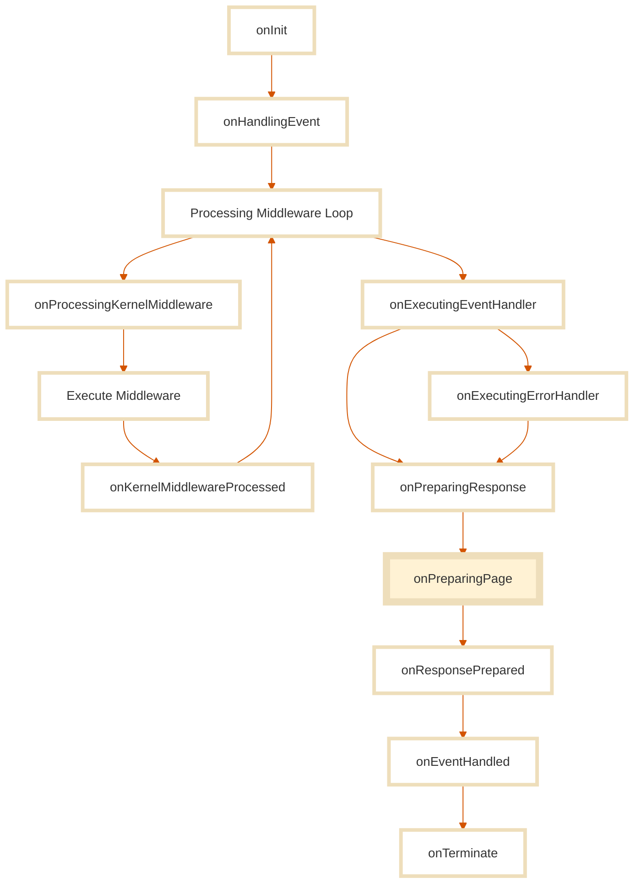

In most frameworks, a page is just a UI component mapped to a route.

In Stone.js, a page is a **context-aware unit of behavior** that participates in the **entire application lifecycle**, before, during, and after rendering.

A page in Stone.js is not simply a visual artifact. It is:

* A **route-bound event handler**
* A **renderable component**
* A **functional unit of context**
* A **gateway between functional and visual logic**

Stone.js pages are powered by the **Continuum Architecture**. That means they:

* Integrate with routing, dependency injection, and middleware
* Respond to incoming events from any environment (server, browser, serverless, etc.)
* Participate in lifecycle hooks like `onInit`, `onPreparingPage`, `onTerminate`
* Render UI using a **React functional component**

This model offers full separation of concerns:

* **Stone.js** handles context, routing, data, and infrastructure
* **React** handles rendering, DOM interaction, and local component state

Together, they form a **continuum** between the system and the view.

::: info
You don't have to manage the glue between route, lifecycle, and rendering, Stone.js does it for you.
:::

### Not just another component

A Stone.js page is not a React component with a route slapped on top.
It’s a **complete unit of interaction** in a system-aware architecture.

Unlike typical frameworks where you return JSX and sprinkle some router sugar, here, your page:

* Participates in the functional lifecycle
* Handles system incoming events
* Can use middleware, lifecycle hooks, dependency injection, and error handling
* And only **then**, returns a React tree to render

This means a page is **not**:

* A class component
* A hook-based view with `useEffect` everywhere
* A glorified wrapper around React Router

It’s a **system construct** that delegates rendering to React, **not the other way around**.

```ts
export class Application implements IComponentEventHandler<ReactIncomingEvent> {
  constructor(private readonly container: IContainer) {}

  handle(event: ReactIncomingEvent): { message: string } {
    return { message: 'Hello world!' }
  }

  render({ data }: RenderContext<{ message: string }>): ReactNode {
    return <h1>{data?.message}</h1>
  }
}
```

React does the rendering.
Stone.js does the orchestration, context resolution, error management, and hydration.

Together, they form a continuum, not a stack.

## Defining Pages

A page in Stone.js is an **event handler** that renders a view.

It can be defined using:

* A **class** (recommended for structure, decorators, and lifecycle)
* A **factory function** (useful for dynamic composition or DI-driven construction)

Regardless of shape, all pages must implement the `IComponentEventHandler` interface from `@stone-js/use-react`.

This interface provides three optional hooks:

* `handle()`, to process the incoming event
* `head()`, to return metadata like title and meta tags
* `render()`, to return a **React functional component** (required)

Stone.js doesn’t enforce a specific file structure or naming convention.
You’re free to organize pages in `app/pages`, co-locate them by feature, or group by adapter, it’s your call.

What matters is **what they do**, not how they’re stored.

::: tabs#class-factory
@tab:active Class-based
### Class-based Page

Use this shape when you want introspection, lifecycle hooks, and decorator-based configuration. It is the most structured and recommended form.

```ts
import { IComponentEventHandler, ReactIncomingEvent } from '@stone-js/use-react'

export class Application implements IComponentEventHandler<ReactIncomingEvent> {
  handle(event: ReactIncomingEvent) {
    return { name: event.get('name', 'World') }
  }

  render({ data }: RenderContext): React.ReactNode {
    return <h1>Hello, {data?.name}</h1>
  }
}
```

@tab Factory-based

### Factory-based Page

If you need runtime flexibility or functional programming, use the factory shape. It’s fully supported and highly composable.

```ts
import { IContainer } from '@stone-js/core'
import { ReactIncomingEvent } from '@stone-js/use-react'

export const Application = (container: IContainer) => {
  const userService = container.resolve(UserService)

  return {
    async handle(event: ReactIncomingEvent) {
      return await userService.getGreeting(event.get('userId'))
    },

    render({ data }: RenderContext): React.ReactNode {
      return <h1>{data.message}</h1>
    }
  }
}
```
:::

Both formats are interchangeable and interoperable, you can use class pages in some routes and factory pages in others.

The shape you choose does **not** impact SSR, hydration, routing, or page behavior.
Choose the form that fits your module’s complexity.

::: tip
But it is recommended to choose one style and stick to it for consistency.
:::

## Registering Pages

Once a page is defined, it must be registered in your application blueprint so that Stone.js knows how to route events to it.

There are two styles of registration:

* **Declarative**, using decorators (for class-based pages)
* **Imperative**, using blueprint utilities (for class or factory pages)

In both cases, pages are treated as event handlers operating in the **functional dimension**.

::: tabs#declarative-imperative
@tab:active Declarative
### Declarative Registration

This approach is ideal when using class-based pages and decorators. It gives you maximum introspection and automatic lazy-loading support (in multi-page apps).

```ts
import { StoneApp } from '@stone-js/core'
import { UseReact } from '@stone-js/use-react'
import { Browser } from '@stone-js/browser-adapter'

@Browser()
@UseReact()
@StoneApp()
export class Application implements IComponentEventHandler<ReactIncomingEvent> {
  constructor(private readonly container: IContainer) {}

  handle(event: ReactIncomingEvent): { message: string } {
    return { message: 'Hello world!' }
  }

  render({ data }: RenderContext<{ message: string }>): ReactNode {
    return <h1>{data?.message}</h1>
  }
}
```

This way, you have a mono-route app that handles all incoming events. Refer to the [Routing documentation](./routing) for more details on how to register multiple routes.

@tab Imperative
### Imperative Registration

Use this approach when:

* You define your page as a factory function
* You want runtime control over route configuration
* You need conditional logic during registration
* You are doing functional programming

```ts
import { browserAdapterBlueprint } from '@stone-js/browser-adapter'
import { defineBlueprintConfig, IBlueprint, stoneBlueprint } from '@stone-js/core'
import { useReactBlueprint, defineComponentEventHandler } from  '@stone-js/use-react'

export const Application = (container: IContainer) => {
  const userService = container.resolve(UserService)

  return {
    async handle(event: ReactIncomingEvent) {
      return await userService.getUser()
    },

    render({ data }: RenderContext) {
      return <h1>Welcome, {data?.name}</h1>
    }
  }
}

export const AppBlueprint = defineBlueprintConfig((blueprint: IBlueprint) => {
  blueprint
    .set(stoneBlueprint)
    .set(useReactBlueprint)
    .set(browserAdapterBlueprint)
    .set(defineComponentEventHandler(Application, true))
})
```

`defineComponentEventHandler()`: 
* Works with any shape: class and factory.
* The `true` flag indicates this is a factory page.
* Works only for mono-route apps, for multi-route apps refer to the [Routing documentation](./routing).
:::

::: tip
In a **mono-route app**, you don't need to declare any route, the page is simply your app entry point.  
In **multi-route apps**, you must register your routes using the Stone.js Router (see the [Routing documentation](./routing)).
:::

### Mono-route vs Multi-route Applications

* **Mono-route apps** only require one registered page. It will handle all incoming events.
* **Multi-route apps** require you to define each route explicitly, using either API style.
* Routes in Stone.js support advanced features: parameter validation, bindings, aliases, protocols, and more.

See the [Routing documentation](./routing) for the full routing API available to your pages.

## Page Lifecycle

In Stone.js, every page operates across two interconnected dimensions:

* The **functional dimension**, where Stone.js manages context, routing, services, middleware, hooks, and data resolution
* The **view dimension**, where React takes over to render the UI tree and manage DOM interactions

Stone.js orchestrates the entire page flow **up to the rendering point**. After that, control is passed to React.

::: important
Once the page is rendered, Stone.js steps back, and React takes full control.
:::

This lifecycle ensures that:

* All data is fetched and injected **before rendering**
* System-level responsibilities like DI, routing, snapshots, and middleware are resolved
* Rendering is **deterministic**, **contextual**, and **isolated**

### Lifecycle flow

Here’s what happens when a page is invoked:



::: important
It is important to understand that these lifecycle hooks are **not** React lifecycle hooks.  
They are Stone.js lifecycle hooks that happen before the rendering phase.
:::

Each step belongs to a **different concern**:

| Phase             | Responsibility                               | Dimension            |
| ----------------- | -------------------------------------------- | -------------------- |
| `handle()`        | Fetch data, validate, process event          | Functional dimension |
| `onPreparingPage` | Last system hook before rendering            | Functional dimension |
| `render()`        | Return JSX tree (React functional component) | View dimension       |

### The `handle()` method

This method is optional but recommended. It runs as part of the **event handling pipeline**.

You can:

* Use the injected `event` to extract params, headers, cookies, etc.
* Fetch data from services using the DI container
* Return raw data or a full `ReactOutgoingResponse`

```ts
async handle(event: ReactIncomingEvent) {
  const id = event.get('id')
  return await this.articleService.findById(id)
}
```

The result of `handle()` is passed as the `data` parameter to the `render()` method.

::: important Snapshotted automatically
In SSR mode, the result is also **snapshotted automatically** and injected into the HTML.
:::

### The `render()` method

This method is **required**. It behaves exactly like a **React functional component** ,  but with superpowers.

It receives a `RenderContext`, giving it:

```ts
interface RenderContext<TData = any> {
  data?: TData
  container: IContainer
  event: ReactIncomingEvent
}
```

This means you can:

* Use `data` from `handle()`
* Access services using `container.resolve(...)`
* Inspect the incoming event (headers, query, cookies, etc.)

```ts
render({ data, event, container }: RenderContext) {
  const user = data?.user
  const router = container.resolve(Router)

  return (
    <div>
      <h1>Hello, {user.name}</h1>
      <button onClick={() => router.navigate('/logout')}>Logout</button>
    </div>
  )
}
```

Stone.js renders this output using the correct renderer depending on the runtime:

| Environment            | Method used                              | Result                                  |
| ---------------------- | ---------------------------------------- | --------------------------------------- |
| **SSR / SOR (server)** | `renderToString` from `react-dom/server` | HTML string returned to the client      |
| **SSR (client)**       | `hydrateRoot` from `react-dom/client`    | Hydrates the HTML and activates React   |
| **SPA / CSR**          | `createRoot` from `react-dom/client`     | Standard React rendering in the browser |

### `head()` – HTML head tags

Your page can also define a `head()` method to populate metadata like title, description, and meta tags.

This is especially useful for:

* SEO
* Dynamic titles based on route data
* Sharing/social previews

```ts
head({ event }: RenderContext): HeadContext {
  return {
    title: `Hello ${event.get('name', 'World')}`,
    description: 'This is a React page in Stone.js',
    metas: [
      { name: 'author', content: 'Stone.js' },
      { name: 'keywords', content: 'stonejs, react, ssr, framework' }
    ]
  }
}
```

HeadContext supports:

```ts
interface HeadContext {
  title?: string
  description?: string
  metas?: HTMLMetaDescriptor[]
  links?: HTMLLinkDescriptor[]
  styles?: HTMLStyleDescriptor[]
  scripts?: HTMLScriptDescriptor[]
}
```

Stone.js will inject these tags into the rendered page, whether on the server (SSR/SOR) or the client (SPA).

### `onPreparingPage` hook

Right before React renders the page, Stone.js emits a special lifecycle hook: `onPreparingPage`.

This hook is your **last chance** to inspect or mutate context before rendering happens.

It occurs after:

* Middleware execution
* `handle()` resolution

And before:

* Snapshot registration (SSR)
* React rendering (DOM or hydration)
* `onResponsePrepared` and `onTerminate` lifecycle hooks

#### Use cases:

* Logging or analytics
* Injecting flags or metadata
* Mutation of the response or event
* Preparing SSR-specific rendering context

#### Example (decorator-based)

```ts
import { Hook, UseReactHookListenerContext } from '@stone-js/use-react'

export class PageLogger {
  @Hook('onPreparingPage')
  logBeforeRender(context: UseReactHookListenerContext) {
    console.log('Preparing page:', context.event.pathname)
  }
}
```

The `@Hook()` decorator and the `defineHook` utility from `@stone-js/use-react` provide full TypeScript support, enabling type safety and rich IDE features like autocompletion and inline documentation for the UseReact hooks.

#### Hook Context

```ts
interface UseReactHookListenerContext {
  data: any
  error?: any
  head?: HeadContext
  container: IContainer
  event: ReactIncomingEvent
  snapshot: ResponseSnapshotType
  response: ReactOutgoingResponse
  componentType: React.ElementType
}
```

### SSR: Dual Execution Lifecycle

In SSR mode, the page lifecycle executes **twice**:

1. On the **server**:

   * Runs `handle()`
   * Generates the HTML using `renderToString()`
   * Snapshots the result

2. On the **client**:

   * Hydrates the page using `hydrateRoot()`
   * Replays lifecycle hooks
   * **Does not refetch data** (thanks to snapshots)

This guarantees consistency between server and client, while preserving full control over lifecycle and context.

::: important
This dual-execution is necessary: Stone.js defers context detection to runtime, so lifecycle hooks must run on both ends.
:::

## Pages Hooks Explained

Once your page reaches the `render()` phase, Stone.js has already done its job. But your page still has access to **powerful utilities** and **contextual behavior** that help you shape the outcome of an incoming event or interaction.

These hooks and helpers let you respond, redirect, and access data in a context-aware way.

### `ReactIncomingEvent`: One event to rule them all

Every page receives a `ReactIncomingEvent` as its event type. This object **wraps and abstracts** the underlying runtime event:

| Runtime   | Wrapped Event Type     |
| --------- | ---------------------- |
| SSR / SOR | `IncomingHttpEvent`    |
| CSR / SPA | `IncomingBrowserEvent` |

You never need to check where your code is running. Just use the event consistently:

```ts
handle(event: ReactIncomingEvent) {
  const locale = event.get('locale', 'en')
  const query = event.query.get('q')

  // Fully context-aware, platform-agnostic
}
```

The `ReactIncomingEvent` unifies request parsing, header access, cookie handling, user agent parsing, and much more.

::: tip
Wherever your app runs, this event gives you **one consistent interface**.
:::

### `ReactOutgoingResponse`: Full control when needed

By default, you can return raw data from `handle()` and let Stone.js wrap it for you.
But if you want full control over headers, status codes, or advanced behavior (like redirection), you should return a `ReactOutgoingResponse`.

Use the utility function `reactResponse()` to create one:

```ts
import { reactResponse } from '@stone-js/use-react'

handle(event: ReactIncomingEvent) {
  const response = reactResponse({ content: { name: 'Stone' } })
  response.status(201).header('x-app-version', '1.0.0')
  return response
}
```

Stone.js will:

* Automatically infer the correct response type (`Http`, `Browser`)
* Snapshot the data if SSR is enabled
* Send the correct output for your environment

You still get full hydration, even with a manual response.

### Redirection: `reactRedirectResponse()`

If you need to redirect from within your `handle()` method or a middleware, use the utility `reactRedirectResponse()`.

```ts
import { reactRedirectResponse } from '@stone-js/use-react'

handle(event: ReactIncomingEvent) {
  if (!this.authService.isAuthenticated()) {
    return reactRedirectResponse('/login')
  }

  return { message: 'Welcome back!' }
}
```

This response:

* Triggers a browser navigation in CSR
* Sends an HTTP 302 in SSR/SOR
* Works identically in middleware or page logic

::: tip
Don't use the `Router.navigate()` method inside `handle()` or middleware ,  it only works inside the React component tree **after rendering**.
:::

### Meta tags: `head()`

As explained earlier, pages can define a `head()` method to customize metadata for the rendered page:

```ts
head({ data }: RenderContext): HeadContext {
  return {
    title: `Profile of ${data.user.name}`,
    metas: [
      { name: 'description', content: 'User profile page' },
      { name: 'author', content: 'Stone.js' }
    ]
  }
}
```

This works in all rendering modes and is essential for SEO, OpenGraph, and analytics.

## Best Practices

Designing pages in Stone.js is not just about wiring up a route and returning JSX, it’s about composing context-aware, modular units that cooperate across dimensions.
Here are best practices to help you get the most out of Stone.js pages:

#### Separate concerns clearly

* Use `handle()` to process the **intent** (event) and fetch or compute **data**.
* Use `render()` to output the **view**, keeping it clean and stateless.
* Use `head()` to define metadata, don’t set it imperatively elsewhere.

This clear split between functional and view dimensions keeps logic predictable, testable, and easier to debug.

#### Prefer class-based pages for most use cases

Class pages give you:

* Decorator-based registration (`@Page()`)
* Better introspection for tooling
* Lifecycle hook integration
* Cleaner dependency injection

Factory pages are great when you need dynamic logic or runtime-driven composition, but for most routes, classes are more declarative and maintainable.

#### Let Stone.js do the orchestration

Avoid:

* Manually handling SSR logic
* Writing hydration-specific code
* Manually injecting metadata

Instead:

* Return raw data from `handle()`
* Let Stone.js snapshot it
* Define `head()` as needed

Trust the framework to manage the flow, **it’s built for that.**

#### Use `ReactIncomingEvent` everywhere

This event type is platform-agnostic and automatically adapted to your runtime:

* No need to check if you're in the browser or server
* Works the same across SPA, SSR, and SOR
* Exposes cookies, headers, query, user-agent, and more

#### Keep pages light, delegate logic to services

Avoid bloating your `handle()` method with deep logic or manual validations.
Instead, inject services and keep your handler focused:

```ts
return await this.authService.validateToken(event.cookies.get('token'))
```

This keeps pages declarative, and your business logic reusable across multiple modules.

#### Redirect using `reactRedirectResponse()`

Avoid using `router.navigate()` in `handle()` or middleware, it won’t work reliably in SSR or SOR.

Instead:

```ts
return reactRedirectResponse('/login')
```

It will adapt to your runtime automatically.

## Summary

A **Stone.js Page** is a structured unit that connects **user intention** to **visual outcome**, bridging the **functional dimension** of your application with the **view dimension** powered by React.

Unlike frameworks that reduce pages to route-bound components, Stone.js treats pages as full-fledged **contextual actors**:

* They receive normalized, platform-agnostic **incoming events**
* They participate in lifecycle orchestration and system-level hooks
* They return fully reactive, renderable **React components**
* They can control metadata, redirection, error handling, and hydration with precision

Each page is made of three core methods:

* `handle()` → fetch or process data in the functional dimension
* `render()` → return JSX using React in the view dimension
* `head()` → provide head metadata like title, meta, and links

Pages can be registered declaratively or imperatively, and can be structured as classes or factories, depending on how much introspection or flexibility you need.

Stone.js provides automatic:

* **Routing integration**
* **Context injection** (DI container, incoming event, snapshot data)
* **SSR hydration** using snapshots
* **Error delegation** and lifecycle visibility

And most importantly:
**Once the page is rendered, Stone.js steps back and React takes full control.**

That’s the power of the Continuum: clean boundaries, contextual flow, and zero-friction rendering across platforms.

A Stone.js page is not a view.
It’s a conversation between the system and the user, shaped by context, delivered by logic, and rendered through React.
